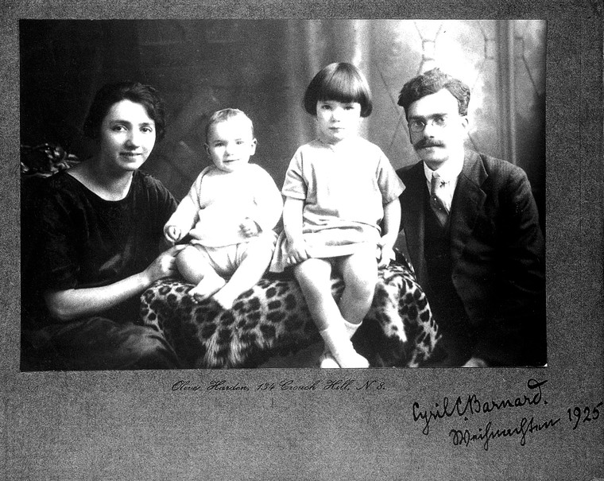

# Barnard, Cyril Cuthbert

Born 23 July 1894, St. Margaret’s, Twickenham, Middlesex, England. Died 6 March 1959, London.

Later [Librarian at the London School of Hygiene and Tropical Medicine](https://blogs.lshtm.ac.uk/library/2016/05/05/cyril-cuthbert-barnard-1894-1959-librarian-and-the-wedgwood-pottery-connection/), 1921 - 1959

[Biographical notes published in _Archives of Natural History_](https://www.euppublishing.com/doi/full/10.3366/anh.2019.0567)\_\_

