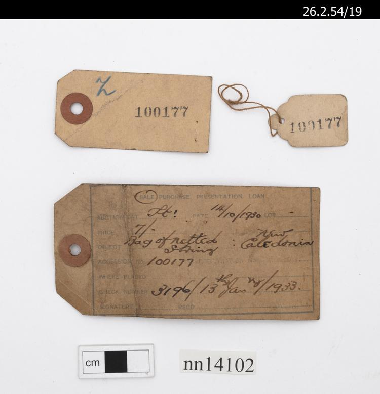

# Museum Accession Numbers

An accession system was begun for museum objects in 1929. Accession records were kept on individual index cards or 'flimsy' slips \(WA/HMM/CM/Inv/A.1-A.231\), and assigned accession numbers were affixed to objects with one tag attached to the object, another on the outer paper wrapping. 

This new system meant that more than one person could accession at a time \(each being given a batch of numbers to assign to objects\) and that objects, and batches of objects, could be briefly documented with additional detail being added to the card later. Much of the accession card data was copied from auction sale catalogues \(and hence can be inaccurate or misleading\).

A numbers were issued in a simple sequence of numbers from 1 to 500529, with gaps between A301931 to A400000, and 'undetermined others' \(phrase used in WA/HMM/CM/Cla/1\) between A400000 and A500495. 

