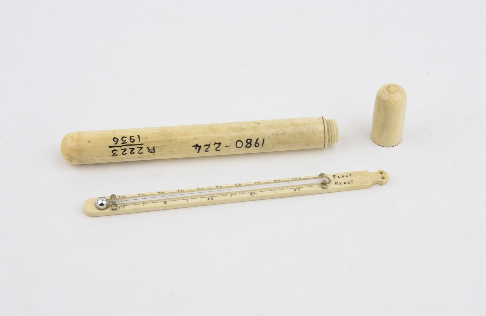

# New Registration System

A new registration system was introduced in 1935 for both new acquisitions and for objects already in the collection. 

This sequence of registration numbers started at R1 each year, followed by the year of registration e.g. R1/1935, R2/1935 etc., then R1/1936, R2/1936, and so forth. 

If objects already had A numbers, or R numbers from the old registration system, these were recorded next to the new registration number in ledger registers \(WA/HMM/CM/Acc/21-56\). There are also index cards for selected R year numbered objects: WA/HMM/CM/Inv/A.240-A.268; A.273. Objects, and batches of objects, continued to be assigned A numbers prior to registration.

On the objects themselves, old numbers were not usually obliterated, but crossed out with a single red line and the new numbers added in white or black ink close by. 

