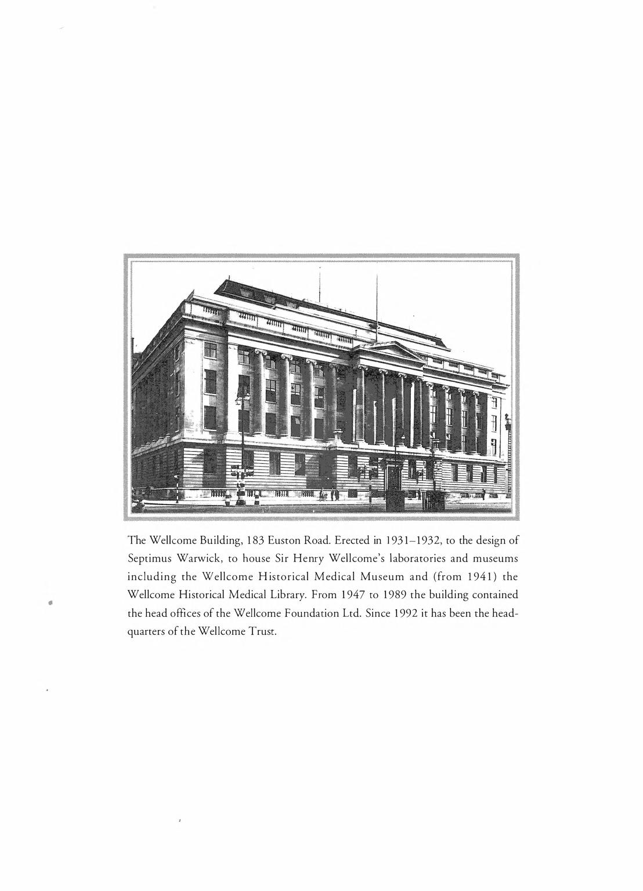

# CC Accessions - Cabinet Cards

![CC2 \[WA/HMM/IC/3/A.1\]](<../.gitbook/assets/image (10).png>)

## **The Transcription Spreadsheet**

The column headings in the transcription spreadsheet correspond – broadly – to the headings printed on the cabinet cards, plus some additional columns for recording details which may be useful for future data analysis and online search. The Cabinet Cards and Museum Flimsy Slips are similar and on occasion what appears to be a Museum Flimsy Slip will appear in the Cabinet Card Sequence. Broadly, the data on either of these styled cards refer to the column headings in your spreadsheet.&#x20;

## **General transcription instructions**

## **More than one object**

Generally, each flimsy slip will be transcribed onto one row of the spreadsheet, except: -

·        **When one slip has more than one object described in detail**:

Split the description over separate rows, with one row for each object. Give each row/description a sub number in sub number column \[1, 2, 3, 4 etc.] unless it already has alphabetical identifier (e.g. three objects on a single slip have been lettered A, B and C) then put the corresponding letter in the sub number column for each row.

·        **When one slip represents a short running sequence of CC numbers**:

Use a separate row on your spreadsheet for each number in the sequence, transcribing the details from the card onto each row. This can appear, for example, "CC1234- CC1237" with four objects on the single slip.

## **Pencil writing**

If you see this, please transcribe as per usual in the respective fields i.e. if half the description is in pen and the other in pencil, transcribe all of it in the description column.

You do not need to note that there is pencil writing on the slip or what colour pen.

If it is unclear where the pencil writing is meant to go, please enter it into additional notes column and highlight that you have done this in the transcribers note column.

## **Question marks**

If there is an original question mark within a field and/or writing on your cabinet card, please transcribe this exactly as it is and record this in the transcribers notes column. i.e. ‘?’ in description of object transcribed as found on cabinet card.

Description of object: ? Pastel of a mill. In gold frame, damaged, 12” x 10¾”

.png>)

## **Unsure about something**

If there is something you are unsure of, please note it as \[?] and make sure there is an ‘Unsure:’ note in the transcriber’s column, describing what it is you are unsure of. You can also ask a question in the Teams site, as someone in the transcribing community may be able to identify/confirm what it is you are unsure of.

## **Crossed out writing**

For any text which has been crossed out or scored through, please transcribe it using: **\<s>**and **\</s>** tagging:

\<s>\[transcribed text here]\</s>

## **Gaps in accession numbers**

You may notice gaps in the accession numbers, this is normal. You can record in the transcribers notes column that there is no cabinet card in sequence for the CC number that is missing.

## **Sketches and drawings**

You may come across illustrations on the front or back of a cabinet card. Please make a note of any found in the transcribers notes column in the following format: ‘Illustration of object drawn on front/reverse of card’.

## **Stamps**

If you see a stamp on your cabinet card, transcribe this information proceeded by \[Stamp]. i.e. \[Stamp] Engraving. In the example below, the stamp is across multiple headings, so this would be recorded in the additional notes’ column on your spreadsheet. **\*All stamps should be recorded in the additional notes’ column.\***

&#x20;

.png>)

&#x20;

If there is both a stamp and additional notes, please put all the additional notes first and then the stamp transcription.

## **Dispersals/Transfers**

Some stamps or handwritten text on your cabinet card will refer to where an object has been transferred or dispersed to. This too needs to be recorded in the additional notes’ column on your spreadsheet, proceeded by \[Dispersal]. In the example below you would record: ‘\[Dispersal] Sent to Alford House for Sale’

From the cabinet card itself we do not know if the item was sold, but grouping data for all items that were sent to Alford House may help us find out in the near future.

&#x20;

.png>)

&#x20;

## **Non-Latin script**

If you notice anything is written in non-Latin script and you cannot discern or transliterate it, please put \[…] and make a note that you have come across non-Latin script the ‘Transcriber’s notes’ column.

## **Acquisition vs Accession**

**Acquisition date** – When the item/object/record was acquired e.g. the date it was bought at an auction

**Accession date** – When the item/object/record was accessioned into the collection

**Fractions**

Transcribe fractions (e.g. in measurements) using Insert – Symbol and selecting the correct proper fraction. If you encounter difficulties in finding the correct symbol, record this in the **transcriber’s notes**.

The following are keyboard shortcuts that can be used instead of the insert method:

o   **Alt + 0188 = ¼**

o   **Alt + 0189 = ½**

o   **Alt + 0190 = ¾**

All other fractions **need to be written out** as e.g. 5/8

Remember to put a space _before_ you write out the fraction e.g. 3 5/8"

&#x20;

## **Column headings**

## **Visual Accession Number Prefix**

This is a prefilled column denoting CC, and is not for you to add to or edit. This is to assist data import in to QuickBase once your transcription has been completed. This field may be hidden.

## **CC Number \[New Number]**

This is the sequential CC number, prefilled in your template and can be found in the top left corner of your index card as New No. The number on the card however is not prefixed by a ‘CC’.

There are occasions where a number has been duplicated but additionally attributed with ‘A’ ‘B’ ‘C’.

Example:

CC30 also has a card for CC30A, CC30B and CC30C

You will need to insert a line into your spreadsheet to record cards like this in excel, ensuring you input data into the Sub number column. (see general guidance under more than one object)

If you find a number out of sequence from your allocation i.e. you are given C1 – 100 to transcribe and you find a cabinet card numbered 302, you would add this to the bottom of your spreadsheet and add a comment to the transcribers notes column.

## _**WA/HMM reference**_

This is a column that will be prefilled with the archive reference to the index card collection in your spreadsheet. For CC1 – CC500 series this reference is **WA/HMM/IC/3/A.1** This is not something taken from the index card to transcribe and will often be a hidden column in your template.

## **Image Number**

This is the digital image number of the cabinet card and needs to be inputted by the transcriber. Please note that sometimes a blank image or reverse of the cabinet card is digitised so one cabinet card may take up two image numbers.

.png>)

## **Sub Number**

This is not a heading on your cabinet card, but for CC numbers that have been duplicated but given a part number need to be recorded here. For example, in register **WA/HMM/IC/3/A.1,** CC2 has a card for CC2 and CC2A. The cabinet card for 2A would have ‘A’ as the sub number. ‘2A’ would not be recorded in the ‘New Number Column’.

.png>)

## **Present Number**

This column in your spreadsheet corresponds to the second heading from the top left of the index card. Whilst not always filled out on the index card, where there has been data to record, this appears to be a classification reference. Please capitalise the data in your spreadsheet, so ‘Mis’ for example would be recorded as ‘MIS.’ If nothing is recorded on the index card against ‘Present No’ leave the field in your spreadsheet blank.

## **Provisional Classification**

This is the third heading from the top left of the index card and is largely recorded as ‘CC’, which for the CC series appears to be visual items that happen to be framed. Entries to date in this series have described engravings, watercolours, pencil drawings, oil paintings, paintings on panels and canvases. Please capitalise the classification in your spreadsheet with no punctuation between the letters.

## **New Classification**

This is another classification heading on the index card. Sometimes the card records more than one classification and in this case should be separated on your spreadsheet by a semicolon. In the example below this would be recorded as ‘W; SH’

## **Description of Object**

Transcribe all that you see here including the dimensions with the fractions.

&#x20;

## **Bought of**

This typically records the place of purchase/donor with the date and lot number (acquisition details). Sometimes the name of the auction house is given in full, and at other times you will be given initials i.e. K.F & R stands for Knight Frank and Rutley. Record this in your spreadsheet as found on the index card, **except** for the year given in the date.

For example: ‘K.F. & R. 30/7/19. Lot 978’ should be recorded as ‘K.F. & R. 30/7/**1919**. Lot 978.’

.png>)

&#x20;

Sometimes the date is recorded as a range, where a sale may have taken place over 2 or more days. If a range is given record as is in this field. i.e. ‘Lot 851. 25-30/6/1919 at Easton Park.

In the acquisition date field, you would standardise the date to the last possible date of sale i.e. 30 June 1919. In transcribers note’s you would record that you had standardised this to the last possible date the item could have been purchased.

.png>)

Other times the date may also include roman numerals, again record as is: Fos/99/12/ii/1919. In this case the lot number has been recorded before the date. When recording the date in the acquisition field you can record 12 February 1919.

&#x20;

.png>)

&#x20;****&#x20;

## **Value**

This is sometimes recorded as pounds, shillings and pence, but you may only see this as a value where the ‘£’ is given. **£2.10.0** Other times only shillings and pence are recorded **31/6**. Please transcribe as on the index card. If no value is given leave the field black in your spreadsheet.

## **At present**

At present refers to the item’s current location at the time the cabinet card was created. Sometimes this is recorded as an address i.e. **76 High Street** or **Stratford Mews**. Other times only initials are used to denote a location. i.e. ‘**C.P.**’ Please transcribe as you find on the index card.

If a location has been crossed out or struck through and you can still read what was recorded, please transcribe with tagging as follows: \<s>\[76, High Street]\</s> Stratford Mews

.png>)

The struck through text is given inside the closed brackets.

Closed brackets can also be used if you are unsure of a word or letter, so if you were not sure the above read as ‘Stratford Mews’ you could record as follows: \[Stratford Mews?] You could then flag this as something you were unsure of in transcribers notes to help the checking process when you return your completed transcription.

&#x20;

## **To be placed**

This refers to where the item should go to – its future location. Initials denoting a location are often recorded here i.e. ‘W’ ‘H.M.M.’ and ‘G.G.’ Transcribe as you find.

## **Additional notes found on flimsy**

For any other information recorded on the index card that doesn’t fit neatly under any of the above headings can be recorded here, including previously mentioned stamps.

## **Object Name**

Within the description that you have already transcribed there will likely be a reference to the object name including watercolour, oil painting, engraving etc. In this column of the spreadsheet, please select the object name from the picklist. This will help with searchability of the collections. If something in the description is not represented on the picklist, please use either the broadest term or add a comment in transcribers notes. When we review templates and guidance we can then add in any additional names to the picklist if needed. If it is unclear leave blank.

## **Acquisition Date**

This is to record the date of acquisition in full. i.e. instead of 1/1/19 it should read 1 January 1919. Please don’t record ‘1st’ ‘2nd’ ‘3rd’ etc. This information you will duplicate from the bought of field. Please check your column is formatted correctly. By writing the date in full it easier to check that 1919 does not read as 2019.

Where the date written on the cabinet card is given **only as a month**, **year**, or **span of days**, enter the latest date at which the object(s) can have been acquired. Examples are as follows:

·        Month and year: **August 1952** should be entered as **31 August 1952**

·        Year only: **1924** should be entered as **31 December 1924**

·        Span of days: **17-20 January 1930** should be entered as **20 January 1930**.

·        For dates in February, you may find [this list of leap years 1800 - 2400](https://kalender-365.de/leap-years.php) useful.

·        Leave the field **blank** where **no date at all is written** on the cabinet card **unless** the date of acquisition can be reasonably assumed from other contextual evidence (e.g. adjacent card recording objects acquired from the same source).

&#x20;

If you have to normalise the dates as explained above, **leave a note in transcribers notes saying: ‘Acquisition date normalised to last possible date item could have been acquired.’**

## **Auction House**

In many cases, the acquisition will be an auction purchase - e.g. **Soth. 6 & 7/12/20 Lot 196** refers to lot 196 sold at Sotheby’s during the sale held on 6th and 7th December 1920.

Sometimes the lot number appears before the date, and the month may appear in Roman numerals (Soth. 91/1/XII/30).

&#x20;****&#x20;

In your spreadsheet there is a picklist ready for you to select the auction house (where appliable) that the item you have transcribed was purchased from. This information is often recorded in the description. If the auction house is not present in the picklist, please record this in the transcribers’ notes.

These abbreviations can be expanded using the list below. Select the relevant auction house from the dropdown list on your spreadsheet.

&#x20;

.png>)

## **Lot Number**

Please record the lot number where applicable, often recorded under the description of article.

## **Transcribed by**

In this column of the spreadsheet, please record your email address as opposed to your name.

## **Transcribers Notes**

Please use this for anything you are unsure of or would like checking or flagging to Transcribe Wellcome Staff. This helps us when we come to check through the transcription, prior to its upload to QuickBase.

If flagging something you are unsure of please prefix this note with ‘Unsure’ followed by an explanation.

&#x20;

If you have made a remark that relates to more than one accession, please make sure you add it into every relevant **Transcriber’s Notes** column. Do not use the phrases ‘see above’ or ‘see below’ in any column, each row needs its own note.

&#x20;

## **Creative Commons License**

This is another column of the spreadsheet that has been pre-filled as a reminder that your transcription will be used under a CC0 license.

**Potential Sensitivity**

It is possible that sensitive and offensive language has been recorded on the index cards, please still transcribe as you find. You can use the potential sensitivity column to flag any language here. i.e. Language: use of the word negro.

**Upon Completion**

Please upload your file to Grp\_Wellcome Transcribers on Microsoft Teams. [https://teams.microsoft.com/l/channel/19%3a7358e913235e4459abd93d73245a1c72%40thread.tacv2/General?groupId=4e7ed022-a0ad-4baa-89c6-490da57430b6\&tenantId=3b7a675a-1fc8-4983-a100-cc52b7647737](https://teams.microsoft.com/l/channel/19%3a7358e913235e4459abd93d73245a1c72%40thread.tacv2/General?groupId=4e7ed022-a0ad-4baa-89c6-490da57430b6\&tenantId=3b7a675a-1fc8-4983-a100-cc52b7647737)

At the top of the group’s page you will see a ‘Files’ tab. In that tab you will see a ‘Completed Spreadsheets’ folder, please upload your file there.

Once you’ve done this please leave a message in your respective channel that you’ve uploaded your sheet.

&#x20;

&#x20;

&#x20;

&#x20;

&#x20;

&#x20;

&#x20;

&#x20;

&#x20;
