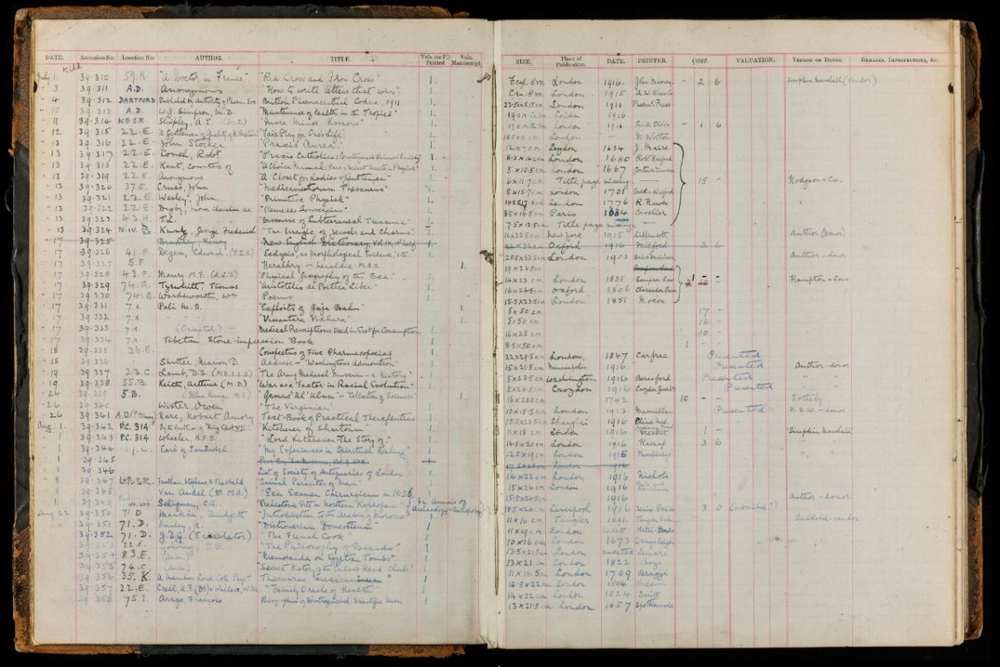

# Library Registers

## The Transcription Spreadsheet

The column headings in the transcription spreadsheet correspond – broadly – to the headings printed in the thirteen Library Accession Registers, plus some additional columns for recording details which may be useful for future data analysis and online search. It is indicated in the column heading instructions if, and where, headings differ between spreadsheet and Register e.g. Location Number \[excluding Registers 3;12;13\].

The style of the Accession Registers changed over time, and according to the purpose for which they were used by Wellcome Historical Medical Library, and some headings were rarely used. Fields on the spreadsheet may be hidden for these headings.

**Important note**: Any duplicate library accession numbers should be added to the bottom of your spreadsheet with comments in the **Transcriber’s Notes** column. As duplicate accession numbers require extra checks before importing, please highlight these rows with a colour so that they can be identified easily.

## General Transcription Instructions

Generally, each accession \(unique number\) will be transcribed onto **one** row of the spreadsheet.

For the majority of columns you will be asked to transcribe the information exactly as it appears on the page. For a couple of columns you will be asked to transcribe the information into a standardised format. This is to assist with future research and will be made clear in the individual instructions.

For any text which has been scored through, do the same in the transcription. If you do use the strikethrough, or any other formatted text, you **must** use the appropriate tagging e.g. &lt;s&gt;\[~~transcribed text here~~\]&lt;/s&gt; or &lt;i&gt;\[_transcribed text here_\]&lt;/i&gt; for italics.

In some Registers, earlier information is visible in pencil underneath the final pen entry. If this is the case, add a **Transcriber’s Note** and include any of the information written in pencil where legible.

If you cannot decipher the handwriting use \[.\] to indicate an indecipherable letter e.g. mon\[.\]stro\[..\]ty. The number of dots = number of missing letters. Use \[?\] if you have guessed at a letter or word e.g. Mhairi\[?\]. If you use dots for text or words you are unsure of, please add a \[?\] and make a note in the **Transcriber's Notes** e.g. Unsure: word/letter in title. 

If there are square brackets, question marks or dots in the Register already, add a note to the **Transcriber’s Notes** i.e. The square brackets in the author column are in the original document.

All Latin characters with accents should be transcribed by inserting the correct symbol e.g. Â.

If you notice anything is written in non-Latin script make a note in the **Transcriber’s Notes** and, if you cannot discern or transliterate it, please put \[…\].

If the register uses ‘ditto’ \(sometimes shortened to 'do'\) or ‘//’ in the columns, replace ‘ditto’ with the information from the row above e.g. if one row has the title ‘The Mirror of Beauty’ and the row below has ‘// // // // \(The Dentist\)’, the title of the second book should be transcribed as ‘The Mirror of Beauty \(The Dentist\)’.

You are not expected/required to expand abbreviated words e.g. Imp\[erial\]. Simply transcribe the abbreviation as it appears on the page and, if you can identify the word, add a note to the **Transcriber’s Notes**. If you have larger problems reading the text on the slips, or are unsure of anything, please also note this in the **Transcriber’s Notes** column.

Apart from the **Date of Accession** column leave any blank spaces blank. Blank spaces and columns are common in the Registers and do not need noting.

If you encounter any problems identifying words, letters or symbols head to the [Transcribers’ Group](https://docs.wellcomecollection.org/transcribe-wellcome/transcription-guidelines/grp-wellcome-transcribers) on Microsoft Teams. There may be others who have asked or answered the same questions. A quick google search may also help with titles and authors but the search results should never take priority over the text on the Register page.

## Column Headings

_Please Note: columns in the spreadsheet may be hidden if they are not applicable to a specific Register or do not require transcribing._

### _Date of Accession_ 

_\[Date of Receipt in Registers 12;13\]_

The date of the accession is listed in the first column of the Library Accession Register. Always transcribe the date in full in the order of dd-month-full year e.g. 25 April 1916. Even if the date column is blank or if there are no ditto marks, assume that multiple items were added to the Register on the same day.

To aid filtering and analysis, if several consecutive dates are given, enter the **latest** day that these items were accessioned e.g. 6-9 January 1931 should be entered as 9 January 1931 with a **Transcriber’s Note** saying, ‘Accession date normalised to last day of entry’. If the date of accession is recorded as only a month or a year, provide the last possible date the accession may have occurred e.g. September 1928 should be entered as 30 September 1928 with a similar **Transcriber’s Note** - 'Accession date normalised to final date of month'. For dates in February, you may find [this list of leap years 1800 - 2400](https://kalender-365.de/leap-years.php) useful.

### _AccNo_ 

The accession numbers have already been provided in a sequential order. Use these numbers to keep track of where you are on the page. IMPORTANT: Make sure you double-check the accession numbers as you go along as there may be a break or mistake in the sequential numbering in the Register. If you come across an accession number which is out of sequence, please add this to the bottom of your spreadsheet and add a note to the **Transcriber’s Notes**.

### _LH Page Image no./RH Page Image no._

For each accession number, enter the image number given in the Wellcome Collection website Viewer. If you are transcribing from a PDF, the image number is the page number minus 1. REMEMBER - the information for each row in the Accession Register is split across two pages.

### _Location Number_ 

_\[excluding Registers 3;12;13\]_ 

Enter the location letter/number, if applicable, in this column. Most frequent abbreviations are M.C. \(Museum Case\) and P.C. \(Packing Case\).

### _Author_ 

_\[excluding Register 3\]_ 

Transcribe the information in the ‘author’ column on the Register page. The author name should be standardised to read: Surname, Forenames \(Title, if applicable\) e.g. Braithwaite, William K. \(Capt.\). Do not transcribe brackets around the forenames e.g. Franklin \(Rosalind\) should be standardised to Franklin, Rosalind.

### _Title/Description_ 

Transcribe the information exactly as it is written on the page. Spelling, particularly for the titles of early modern books, can be very different to that of modern-day words e.g. you may see the word ‘chirurgerie’ instead of ‘surgery’. Transcribe titles exactly as they appear on the Register rather than correcting them to modern standards.

### _No of vols. \(V or P\)_

This column will contain a numerical value to show the number of volumes associated with the accession number/title of a printed item e.g. one entry ‘Voyages in the Southern Hemisphere’ is composed of 4 volumes. The column will contain the letter ‘P’ if the item is a pamphlet.

### _No. of vols \(Manuscripts\)_ 

Similar to above, this column will contain a numerical value to show the number of volumes associated with the accession number/title of a manuscript.

### _Size_ 

_\[excluding Registers 3;12;13\]_

Transcribe the size as it appears on the page. The column may contain a measurement e.g. 20 x 15, a format e.g. post 4to, or a mixture of the two e.g. 8vo 23. Transcribe fractions \(e.g. in measurements\) using Insert – Symbol and selecting the correct proper fraction.

The following are keyboard shortcuts that can be used instead of the insert method:  

| Fraction | Keyboard Shortcut |
| :--- | :--- |
| **¼** | Alt + 0188 |
| **½** | Alt + 0189 |
| **¾** | Alt + 0190 |

All other fractions need to be written out as e.g. 5/8, remembering to put a space beforehand, i.e. 3 5/8" as the other Excel symbols do not import onto other platforms.

If you encounter difficulties in finding the correct symbol, record this in the **Transcriber’s Notes.** Please note: The format refers to the size of the book not the number of volumes e.g. 8vo = octavo format. Guidance on technical/archaic format terms [here](https://www.harringtonbooks.co.uk/booksizes.php).

### _Place of Publication \(Imprint\)_ 

_\[excluding Registers 3;12;13\]_ 

Transcribe exactly as on the page. Many place names will be written in Latin e.g. Londini = London, so if you are having any difficulty deciphering the place name you can check for possible places on the [Latin Place Names File](https://rbms.info/lpn/). Do not standardise into English.

### _Date of Publication \(Imprint\)_ 

_\[excluding Register 3\]_

This is the date, usually just a year, in which the book was printed/published. If the date is in Roman numerals transcribe it into Arabic numerals e.g. MDCCLXI = 1761. [Online converter](https://www.periodni.com/roman_numerals_converter.html).

### _Printer_ 

_\[excluding Registers 3;12;13\]_

These may be individuals \(J. Antonius\), publishing companies \(Clarendon Press\) or institutions \(Government Pr\[ess\] Office\). Transcribe as on the page.

### _Price/Cost_

The three columns in the Registers represent pounds \(£\), shillings \(s\) and pence \(d\). If the price is not provided in pounds sterling, simply transcribe the currency as it is written e.g. 36l.

If the price refers to a group of books put in the price and put in brackets for how many items e.g. if the Register lists the price for three books as 20-6-3 transcribe as £20 6s 3d \[3 items\] for each item. If unsure of the number of items put \[? items\]. Provide the range of accession numbers affected in each row of the **Transcriber’s Notes** e.g. Price for 3 items \[40100-40102\].

**Please note**: You only need to add the number of items in brackets when the price refers to multiple accessions e.g. if there is a single price written in the price column for accession number 40101 which also refers to accession numbers 40100 and 40102. This is because, in the future, information in each individual row will appear on its own in searches without the context of the information above and below it on the Register page.

For volumes, it is clear in each individual accession number/row how many volumes there were and what was paid for all of them so you do not need to record that information in brackets or in the notes.

### _Valuation_ 

_\[excluding Registers 3;12;13\]_ 

Transcribe as in the Price column above.

### _Donor or Vendor \(Source\)_

Transcribe the acquisition details as they appear on the page. These may be a name of an individual \(De Bacq\) or an institution \(College of Physicians\). In many cases, the acquisition will be an auction purchase - e.g. Soth. 6 & 7/12/20 Lot 196 refers to lot 196 sold at Sotheby’s during the sale held on 6 and 7 December 1920.

Below are some common auction houses and known abbreviations:

| Auction House | Abbreviation |
| :--- | :--- |
| Bligh & Co. | Blig |
| Bonhams |  |
| Christies | Ch |
| Debenham Stores | Deb |
| Foster | Fos |
| Glendining | Glen |
| Goddard & Smith |  |
| Hampton |  |
| Hodgsons | Hodgson |
| Holland Park |  |
| Hurcomb | H |
| Knight, Frank & Rutley | K. F. & R. |
| Maggs Brothers | Maggs |
| Norbury-Smith & Co |  |
| Puttick & Simpson | P. & S. |
| Philips, Son & Neale | P. S. & N. |
| Pritchard & Co |  |
| Robinson & Harding | R. F. |
| Robinson, Fisher & Harding | R. F. & H. |
| Sotheby's | Soth |
| Stevens | St |
| Sydney Slade, F.A.I. | Redcar |
| Trevers |  |
| Turner & Smith |  |
| Wallis, Riddett & Co |  |
| Wigginton |  |

The auction house list is by no means exhaustive and is presented merely to help with identifying letters/names. As in other columns, transcribe the abbreviations as they appear and note possible expansions in the **Transcriber’s Notes**. Do not attempt to make the transcription ‘fit’ the abbreviation.

### _Lot Number_ 

_\[Register 3 only\]_

Enter the lot number, if applicable, in this column.

### _Condition_ 

_\[Registers 12;13 only\]_

Enter any physical condition notes, if applicable, in this column.

### _Remarks_ 

_\[excluding Register 3\]_

Transcribe any remarks exactly as they appear on the page.

### _Transcribed by_ 

Your email address e.g. j.bloggs@wellcome.org.

### _Transcriber’s Notes_ 

A place for the transcriber to add any additional notes about the record e.g. if the record was written in multiple hands or if the record has corrections/later additions/prefixes. Further examples are given within the guidance for individual column headings and in the general transcription instructions. Also use this column to note any problems you have had with the transcription. Prefix this note with ‘Unsure’ followed by an explanation e.g. ‘Unsure: cannot read first name of author’. 

**Important note:** If you have made a remark that relates to more than one accession, please make sure you add it into every relevant **Transcriber’s Notes** column. In the future, each row may be displayed individually without the context of the rows above and below it. For the same reason, do not use the phrases ‘see above’ or ‘see below’ in any column.

### _Creative Commons Licence_ 

This column assigns the CC0 terms to each row of transcribed data and does not require transcription. More information on the Creative Commons Licence can be found [here](https://docs.wellcomecollection.org/transcribe-wellcome/transcription-guidelines/getting-started#creative-commons-licence).

## Upon completion

Please upload your file to **Grp\_Wellcome Transcribers** on Microsoft Teams. At the top of the group’s page you will see a **‘Files’** tab. In that tab you will see a **‘Completed Spreadsheets’** folder, please upload your file there.

Once you’ve done this please leave a message in your respective channel that you’ve uploaded your sheet.

Happy Transcribing!

#### Version History

<table>
  <thead>
    <tr>
      <th style="text-align:left"><b>Document</b>
      </th>
      <th style="text-align:left"><b>Date</b>
      </th>
      <th style="text-align:left"><b>Notes</b>
      </th>
    </tr>
  </thead>
  <tbody>
    <tr>
      <td style="text-align:left">Version 1.0</td>
      <td style="text-align:left">16 April 2020</td>
      <td style="text-align:left">Adapted from &#x2018;Guide for Transcribers; Museum Index cards&#x2019;</td>
    </tr>
    <tr>
      <td style="text-align:left">Version 2.0</td>
      <td style="text-align:left">20 May 2020</td>
      <td style="text-align:left">
        
Updates to:

        <ul>
          <li>submission of completed spreadsheets</li>
          <li>additions to general transcription notes e.g. non-Latin characters</li>
          <li>blanks in Date of Accession column</li>
          <li>fraction shortcuts in Size column</li>
          <li>different currencies in Price column</li>
          <li>use of email in Transcribed By column</li>
          <li>update to Transcriber&#x2019;s Notes column</li>
        </ul>
      </td>
    </tr>
    <tr>
      <td style="text-align:left">Version 3.0</td>
      <td style="text-align:left">01 July 2020</td>
      <td style="text-align:left">
        
Updates to:

        <ul>
          <li>transcription teams explaining the Transcribers group channel on Microsoft
            Teams</li>
          <li>instructions for duplicate accession numbers</li>
          <li>tagging advice for strikethrough and other formatted text</li>
          <li>accession date normalisation rules</li>
          <li>clarification on using square brackets in the price column</li>
          <li>update to Transcriber&#x2019;s Notes column</li>
        </ul>
      </td>
    </tr>
    <tr>
      <td style="text-align:left">Version 4.0</td>
      <td style="text-align:left">06 October 2020</td>
      <td style="text-align:left">
        
Updates to:

        <ul>
          <li>CC0 licence agreement and column description</li>
          <li>description of Visual Material Registers channel on Teams</li>
          <li>additions to general transcription notes e.g. pencil notations underneath</li>
          <li>email address changed to .org in Transcribed by Column</li>
        </ul>
      </td>
    </tr>
  </tbody>
</table>

