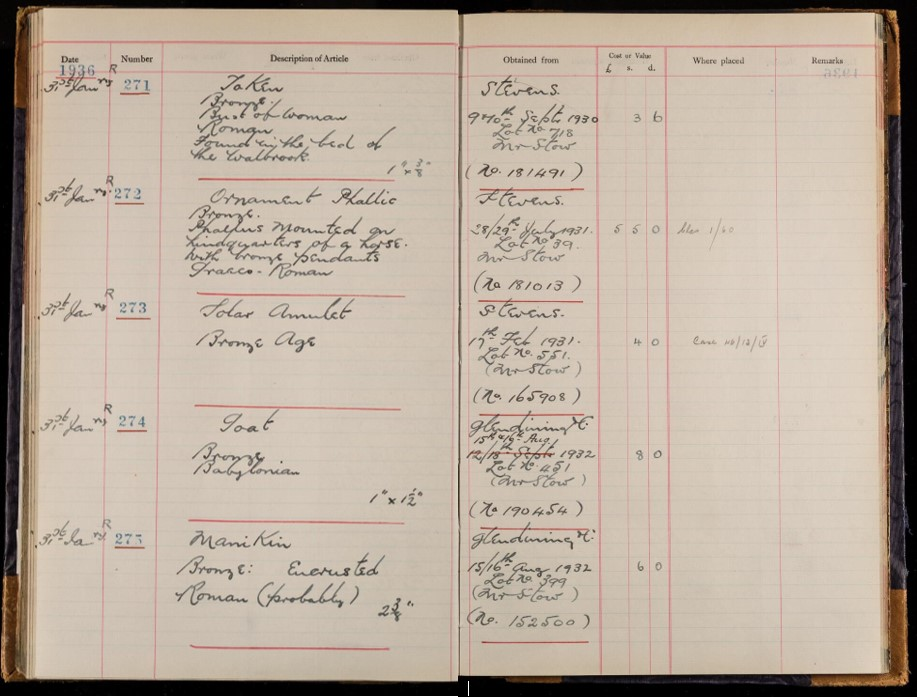
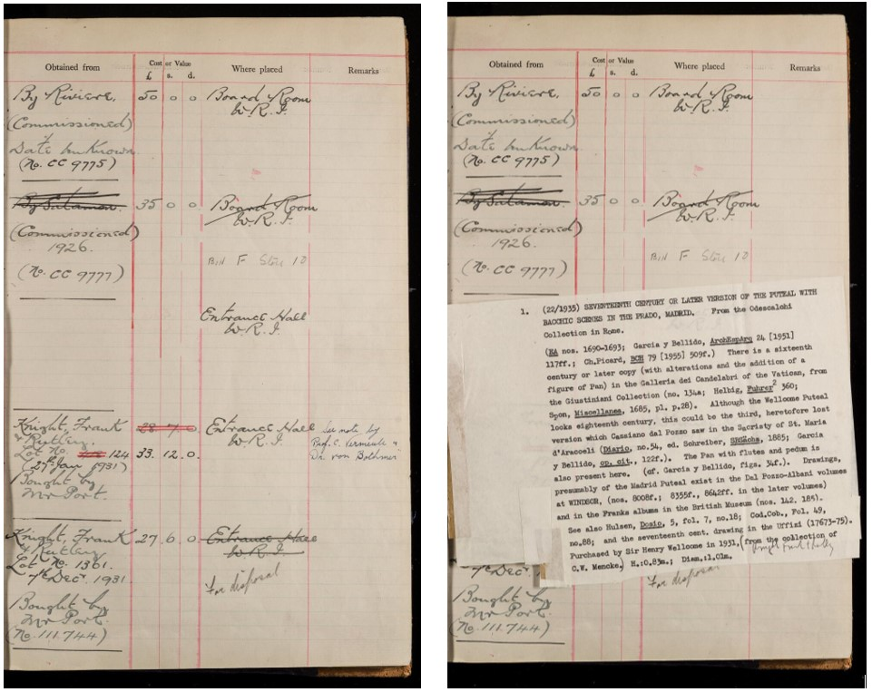
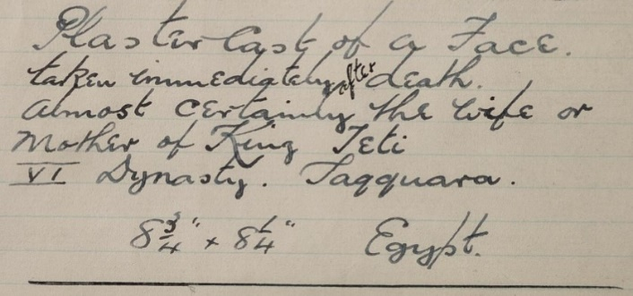
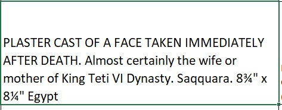
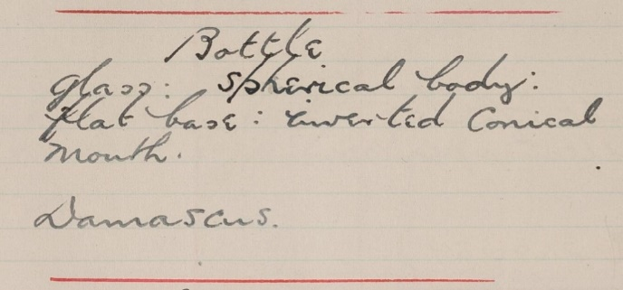
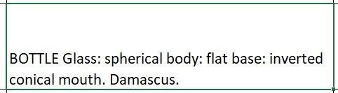

# Museum Accession Registers

## **The Transcription Spreadsheet**

‌The column headings in the transcription spreadsheet correspond – broadly – to the headings printed on the Registers, plus some additional columns for recording details which may be useful for future data analysis and online search. The headings in the spreadsheet will be provided with the corresponding heading from the Registers, where applicable, in square brackets e.g. Registration Date \[Date].

‌The style of the Accession Registers changed over time, and according to the purpose for which they were used by Wellcome Historical Medical Museum, and some headings were rarely used. Fields on the spreadsheet may be hidden for these headings.

### ‌**General transcription instructions**

‌Generally, each accession (New R year number) will be transcribed onto **one** row of the spreadsheet.

For the majority of columns you will be asked to transcribe the information exactly as it appears on the page. For other columns you will be asked to transcribe the information into a standardised format. This is to assist with future research and will be made clear in the individual instructions.

### Blank Columns

Apart from the **Registration Date** column leave any blank spaces blank. Blank spaces and columns are common in the Registers and do not need noting.

### ‌Duplicate/Missing Accession Numbers

Any duplicate New R year numbers should be added to the bottom of your spreadsheet with comments in the **Transcriber’s Notes** column. As duplicate accession numbers require extra checks before importing, please highlight these rows with a colour so that they can be identified easily.

**Important note:** You may notice gaps in the accession numbers, this is normal. Please continue to work with the numbers assigned in the New R year number column.

### Tagging Scored Text or Italics

For any text which has been scored through, do the same in the transcription. If you do use the strikethrough, or any other formatted text, you **must** use the appropriate tagging e.g. \<s>\[transcribed text here]\</s> or \<i>\[_transcribed text here_]\</i> for italics.

### ‌Indistinct Handwriting

If you cannot decipher the handwriting use \[.] to indicate an indecipherable letter e.g. mon\[.]stro\[..]ty. The number of dots = number of missing letters. Use \[?] if you have guessed at a letter or word e.g. Mhairi\[?]. If you use dots for text or words you are unsure of, please add a \[?] and make a note in the **Transcriber's Notes** e.g. Unsure: word/letter in title.

If you encounter any problems identifying words, letters or symbols head to the Transcribers’ Group on Microsoft Teams. There may be others who have asked or answered the same questions. A quick Google search may also help with names and places mentioned in the descriptions but the search results should never take priority over the text on the Register page.

In some Registers, typed text has been pasted onto the page. If this is the case, transcribe as you would the handwritten text and add a **Transcriber’s Note** e.g. ‘Text in the description is typed and pasted onto the page’.

### ‌Special/Non-Latin Characters

If there are square brackets, question marks or dots in the Register already, add a note to the **Transcriber’s Notes** i.e. The square brackets in the author column are in the original document.

‌All Latin characters with accents should be transcribed by inserting the correct symbol e.g. Â.

‌If you notice anything is written in non-Latin script make a note in the **Transcriber’s Notes** and, if you cannot discern or transliterate it, please put \[…].

### ‌Ditto/Abbreviations

If the Register uses ‘ditto’ (sometimes shortened to 'do') or ‘//’ in the columns, replace ‘ditto’ with the information from the row above e.g. if one row has the title ‘The Mirror of Beauty’ and the row below has ‘// // // // (The Dentist)’, the title of the second book should be transcribed as ‘The Mirror of Beauty (The Dentist)’.

‌You are not expected/required to expand abbreviated words e.g. Imp\[erial]. Simply transcribe the abbreviation as it appears on the page and, if you can identify the word, add a note to the **Transcriber’s Notes**.

### ‌**Definitions for general reference**‌

* **Acquisition date –** When the item/object/record was _acquired_ e.g. the date it was bought at an auction
* **Registration date –** When the item/object/record was entered into the Register
* **Accession date –** When the item/object/record was accessioned _into_ the collection

## ‌**Green **Column Headings

_Please Note: columns in the spreadsheet may be hidden if they are not applicable to a specific Register or do not require transcribing._

### ‌_Registration Date \[Date]_

The date of registration is listed in the first column of the Museum Accession Register. Always transcribe the date in full in the order of dd-month-full year e.g. 25 April 1937. Even if the date column is blank or if there are no ditto marks, assume that multiple items were added to the Register on the same day.

### _A number_

The ‘A’ number is an integer up to 6 digits in length, sometimes written with an ‘A’ prefix or suffix, but more often without. Only transcribe the number, without prefix or suffix. If a comma is used in the number (123,456), do not include it in the transcription.

Not all the items will have been assigned an ‘A’ number. If there is one, it is usually written in the ‘Obtained From’ column in the Register with the prefix ‘No.’. For example, when transcribing the note ‘G. E. Sommers. Naples. 1933. Captn Saint (No. 129071)’, you would add 129071 to the **A number** column.

### ‌_Image no. LH/Image No. RH_

For each accession number, enter the image number given in the Wellcome Collection website Viewer. If you are transcribing from a PDF, the image number is the page number minus 1. REMEMBER - the information for each row in the Accession Register is split across two pages.

If the same page has been digitised twice record the page you transcribed. However please add a note to the **Transcriber’s Note** column if the pages show something different.&#x20;

For the example below, most of the information transcribed is on image 17 but there is additional information on image 15. Here you would give the Image no. RH as 17 but transcribe the extra information into the additional notes column and add a **Transcriber’s Note** e.g. Additional notes in 'Remarks' column and typed onto white piece of paper which has been pasted into the accession page (Image No. 15).

&#x20;   &#x20;

### _Old Registration Number / R number_

An ‘R’ running number (e.g. 12345) is easily confused with an ‘A’ number and may appear with an R prefix but more commonly without. PLEASE NOTE: When transcribing in this column, always add the prefix ‘R’ before the number.

Not all the items will have been assigned an ‘R’ number. If there is one, it is usually written in the ‘Obtained From’ column in the Register with the prefix ‘Reg. no.’. For example, when transcribing the note ‘Sent by the section of anaesthetists (Reg. no. 19542)’, you would add R19542 to the R number column.

### _New Registration (R Year) Number \[Number]_

‌‘R year’ numbers represent the number of items registered in a given year. So R148/1935 was the 148th object registered in 1935.

The ‘R year’ numbers have already been provided in a sequential order. Use these numbers to keep track of where you are on the page. IMPORTANT: Make sure you double-check the accession numbers as you go along as there may be a break or mistake in the sequential numbering in the Register. If you come across an accession number which is out of sequence, or a duplicate, please add this to the bottom of your spreadsheet and add a note to the **Transcriber’s Notes**.

### _Description of object \[Description of Article]_

Enter the description of the object(s) in this column, exactly as written on the Register.

To make the text clearer, please capitalise the object name. For example:

 

Or

 

If the description continues onto the second page, transcribe it into the ‘Additional Notes’ column and make a note in the **Transcriber’s Notes**.

If the original handwritten description has been pasted over with typed notes, record this in the **Transcriber’s Notes**.

Transcribe fractions (e.g. in measurements) using Insert – Symbol and selecting the correct proper fraction. If you encounter difficulties in finding the correct symbol, record this in the **Transcriber’s notes**.

‌The following are keyboard shortcuts that can be used instead of the insert method: &#x20;

| Fraction | Keyboard Shortcut |
| -------- | ----------------- |
| **¼**    | Alt + 0188        |
| **½**    | Alt + 0189        |
| **¾**    | Alt + 0190        |

All other fractions need to be written out as e.g. 5/8, remembering to put a space beforehand, i.e. 3 5/8" as the other Excel symbols do not import onto other platforms.

### ‌_Bought of \[Obtained from]_

The acquisition details appear in the ‘obtained from’ column on the Register although this section is not always filled in. You may also come across the phrase ‘No particulars’, sometimes abbreviated to ‘N.P.’. Transcribe exactly as written on the page.

It is in this column where you may find ‘A’ numbers, usually written as (No. 123456) or the old ‘R’ Registration number (Reg. No. 123456) - both of which can be added to their own columns. You may also come across photo negative numbers (N.), storage numbers (S.) or painting numbers (CC). These do not have separate columns but should be noted in the **Transcriber’s Notes**.

### ‌_Value \[Cost or Value]_

The three columns in the Registers represent pounds (£), shillings (s) and pence (d). A price written 3|6|0 should be transcribed as £3 6s 0d. If the price is not provided in pounds sterling, simply transcribe the currency as it is written e.g. 36l.

### ‌_At present \[Where placed]_

Anything recorded in the ‘where placed’ column in the Register should be transcribed here, exactly as it is written. This may refer to multiple locations over the years or even to the object’s disposal.&#x20;

Common places and abbreviations include the Hall of Statuary, W.H.M.M \[Wellcome Historical Medical Museum], S.R. \[Strong Room] or m/clas as well as items sent to Willesden, Boleyn Road, Aldersgate Street, Alford House, Beckenham, Wigmore Street or simply To Store.

### ‌_Additional notes \[Remarks/Insurance and Valuation]_

Use this column to transcribe anything written in the final column of the Register.

Also use this column to enter, exactly as written, any additional notes on the row not previously transcribed. This may include additional notes describing the object or a cancellation stamp. If you are transcribing additional notes outside of the final column in the Register, make a note in the **Transcriber’s Notes** column e.g. Additional notes written across 'value' and 'where placed' columns.

‌**Stamp structure** If you see a cancelled stamp on the page, usually across the R-Year number, enter the information in this column according to the following format: \[Red stamp] CANCELLED 14 FEB 1966. Then add a note in the **Transcriber’s Note** column describing its location on the Register e.g. ‘Red cancellation stamp across R year number’.

If there is _both_ a stamp and additional notes, please put all the additional notes **first** and then the stamp transcription, separated by a semi-colon.

## ‌**Blue Column Headings**

‌_In addition to transcribing text exactly as written on the Register under the green column headings, transcribers should also extract, where relevant, acquisition date, auction house and/or lot numbers into a standardised format. _

_Not all records will include a date, auction house or lot number so please leave these columns blank where this information is not provided._

### ‌_Acquisition Date_

‌This is not the date of registration as transcribed from the ‘date’ column in the Register but the date found in the ‘obtained from’ column. Always transcribe the date in full in the order of dd-month-full year e.g. 25 April 1916.

If several consecutive dates are given, such as when auctions span multiple days, enter the **latest** day that these items were accessioned e.g. 6-9 January 1931 should be entered as 9 January 1931 with a **Transcriber’s Note** saying, ‘Accession date normalised to last day of entry’.

If the date of accession is recorded as only a month or a year, provide the last possible date the accession may have occurred e.g. September 1928 should be entered as 30 September 1928 with a similar **Transcriber’s Note** - 'Accession date normalised to final date of month'. For dates in February, you may find this list of leap years 1800 - 2400 useful. \[add link]

### _Auction House_

In many cases, the acquisition will be an auction purchase - e.g. Soth. 6 & 7/12/20 Lot 196 refers to lot 196 sold at Sotheby’s during the sale held on 6th and 7th December 1920. Sometimes the lot number appears before the date, and the month may appear in Roman numerals (Soth. 91/1/XII/30).

‌Simply select the relevant auction house from the dropdown list:

| **Abbreviation** | **Auction house**          |
| ---------------- | -------------------------- |
|                  | Bonhams                    |
|                  | Brown, Llandudno           |
|                  | Chadwick                   |
| Ch               | Christies                  |
| Deb              | Debenham Stores            |
| Fos              | Foster                     |
| Glen             | Glendining                 |
|                  | Goddard & Smith            |
|                  | Hampton                    |
|                  | Holland and Park           |
| H                | Hurcomb                    |
| K.F.\&R.         | Knight, Frank & Rutley     |
|                  | Norbury-Smith & Co         |
| P.\&S.           | Puttick & Simpson          |
| P.S.\&N.         | Philips, Son & Neale       |
|                  | Pritchard & Co             |
| R.F              | Robinson & Fisher          |
| R.F.\&H.         | Robinson, Fisher & Harding |
| Soth             | Sotheby's                  |
| St               | Stevens                    |
| Redcar           | Sydney Slade, F.A.I.       |
|                  | Trevers                    |
|                  | Turner & Smith             |
|                  | Wallis, Riddett & Co       |
|                  | Wigginton                  |

If you come across an auction house not in the drop-down list, please ensure you make a note of it in the **Transcribers Notes** column.

### ‌_Lot No._

Enter the lot number, if applicable, in this column.

## ‌**Yellow Column Headings**

_These columns are for personal/local notes._‌

### _Transcribed By_

Your email address e.g. j.bloggs@wellcome.org.

### ‌_Transcriber’s Notes_

A place for the transcriber to add any notes about the record e.g. if the record has been typed instead of handwritten or if the record has corrections/later additions/prefixes. Further examples are given within the guidance for individual column headings and in the general transcription instructions. Also use this column to note any problems you have had with the transcription. Prefix this note with ‘Unsure’ followed by an explanation e.g. ‘Unsure: cannot read first name of seller’.

**Important note:** If you have made a remark that relates to more than one accession, please make sure you add it into every relevant **Transcriber’s Notes** column. In the future, each row may be displayed individually without the context of the rows above and below it. For the same reason, do not use the phrases ‘see above’ or ‘see below’ in any column.

### _Creative Commons Licence_

This column assigns the CC0 terms to each row of transcribed data and does not require transcription. More information on the Creative Commons Licence can be found [here](https://docs.wellcomecollection.org/transcribe-wellcome/transcription-guidelines/getting-started#creative-commons-licence).

## **Upon Completion**

Please upload your file to **Grp\_Wellcome Transcribers** on Microsoft Teams. At the top of the group’s page you will see a **‘Files’** tab. In that tab you will see a **‘Completed Spreadsheets’** folder, please upload your file there.

 (2).jpeg>)

Once you’ve done this please leave a message in your respective channel that you’ve uploaded your sheet.

Happy Transcribing!

#### Version History

| **Document** | **Date**        | **Notes**                                                 |
| ------------ | --------------- | --------------------------------------------------------- |
| Version 1.0  | 1_3_ April 2021 | Adapted from ‘Guide for Transcribers; Museum Index cards’ |
