# Museum Flimsy Slips

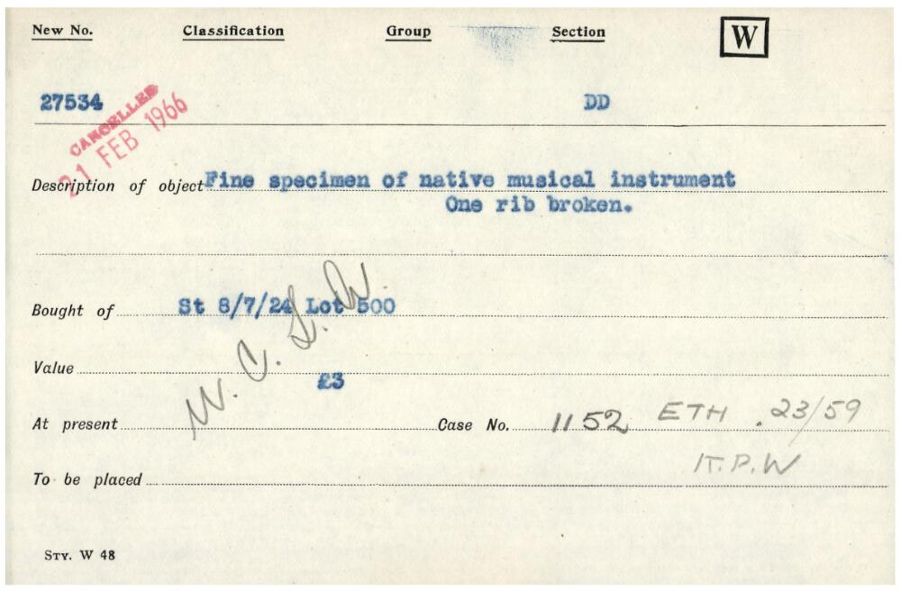

## The Transcription Spreadsheet

The column headings in the transcription spreadsheet correspond – broadly – to the headings printed on the flimsy slips, plus some additional columns for recording details which may be useful for future data analysis and online search.

The style of the printed flimsy slips changed over time, and according to the purpose for which they were used by Wellcome Historical Medical Museum, and some headings were rarely used. _Majority_ of the time the columns will directly correspond with the slip.

## General transcription instructions

### More than one object

Generally, each flimsy slip will be transcribed onto **one** row of the spreadsheet, except:

* **When one slip has** _**more**_ **than one object described in detail:**
  *  Split the description over separate rows, with one row for each object. 
  * Give each row/description a **sub number** in **column E** \[1, 2, 3, 4 etc.\] _unless_ it already has alphabetical identifier **\(e.g three objects on a single slip have been lettered A, B and C\)** then put the corresponding letter in the sub number column for each row
* **When one slip represents a short running sequence of A numbers:**
  *  Use a separate row for each number in the sequence, transcribing the details from the card onto each row. 
  * This can appear, for example, "**A15186-15189**" with four objects on the single slip

### Pencil writing

* If you see this, **please transcribe as per usual** in their respective fields 
  * i.e if half the description is in pen and the other in pencil, transcriber all of it in the description \(column K\).
  * You do not need to note that there is pencil writing on the slip or what colour pen
* If it is unclear where the pencil writing is meant to go, please enter it into additional notes \(column Q\) and highlight this in the transcribers note column.

### Question marks

If there is an original **question mark** within a field and/or writing on your flimsy slip, please transcribe this exactly as it shows and make a note that it is in the original flimsy slip in the transcribers notes column.

### Unsure about something

If there is something you are unsure of, please note it as \[?\] and make sure there is an **‘unsure’** note in the transcribers column, describing what it is you are unsure of.

### Crossed out writing

For **any** text which has been crossed out or scored through, please do it using &lt;s&gt; and &lt;/s&gt; tagging:**&lt;s&gt;**\[transcribed text here\]**&lt;/s&gt;**

### Gaps in accession numbers

You may notice gaps in the accession numbers, this is normal. Please continue to work with the numbers assigned in column A.

### Sketches and drawings

You may see the following image in your batch has a sketching of the object, this is the reverse of the flimsy slip that has been digitised. Please make a note of this sketching in the transcribers notes column in the following format: "**Illustration of object drawn on reverse of slip**".

### **Stamps & labels**

* If you see a stamp on your flimsy slip, enter this information in this column according to the following format: 
  * **\[Stamp\] W.H.M.M. ACCESSION DEPARTMENT. Received DD Month Year. Acc no.\#\#\#**
* If there is _both_ a stamp and additional notes, please put all the additional notes **first** and then the stamp transcription.

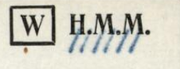

You may notice that some of the labels in the top right are scored through, please list these in additional notes \(column Q\) separated by a semi-colon. This example here would be transcribed as **W; &lt;s&gt;H.M.M.&lt;/s&gt;**

\*\*\*\*[**All stamps and labels go in the "Additional notes found on flimsy" column.**](https://app.gitbook.com/@wellcomecollection/s/transcribe-wellcome/~/drafts/-MVaf8gMXjgrtHP6-FSe/transcription-guidelines/museum-flimsy-slips#additional-notes-on-flimsy-column-q) 

### **Dispersal/Transfers**

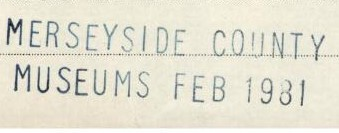

If you notice a slip has a very clear dispersal like the example in the image above, please use the tag **\[Dispersal\]** and list it in the additional notes on flimsy column. The example above would be transcribed as the following: **\[Dispersal\] MERSEYSIDE COUNTY MUSEUMS FEB 1981**

### **Non-Latin script**

* If you notice anything is written in non-Latin script and you cannot discern or transliterate it, please put \[…\]. 
* Please make a note that you have come across non-latin script in column V’s ‘Transcriber’s notes.’

### **Acquisition vs Accession**

* **Acquisition date –** When the item/object/record was _acquired_ e.g. the date it was bought at an auction
* **Accession date –** When the item/object/record was accessioned _into_ the collection

## Green Column Headings

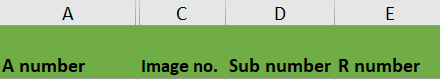

### A number

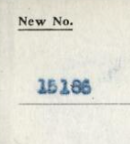

* For each flimsy slip, transcribe the ‘Accessions No.’ \(A number\) for the accession\(s\) described on the slip 
* Each accession is entered into its own row
* This number is usually written in the top left hand corner of the flimsy slip.

This A number is a number of up to 6 digits in length, sometimes written on the flimsy slip with an ‘A’ prefix or suffix, but more often without. Only transcribe the number, without prefix or suffix. **If a comma is used in the number \(123,456\), do** _**not**_ **include it in the transcription.**

Other identifying numbers may also be written on the flimsy slip: **the ‘A’ number will always be the top or first number**, even if it is not at the top left hand corner of the slip.

#### ¡ Duplicate A number or outside of range !

* If you come across an A number for which you have a duplicate please insert a row directly underneath and transcribe this slip in that row
  * You may find that the slip is majority exactly the same with only 1 difference, please still transcribe the whole slip in separate row
* If you come across an A number which is outside your allocated sequence, please transcribe these at the **bottom** of your spreadsheet and add in the A number in column A

#### Crossed out A numbers

If you come across an A number that has been crossed out on your flimsy slip and **re-written,** please enter the **re-written** number _only_ in column A and leave a transcribers note indicating the original number was crossed out and you have entered the re-written number.

If **no** A number is re-written, leave column A _blank_ and leave a transcribers note.

#### ¡ Column B is hidden, please ignore it and keep it hidden !

### Image no.

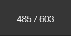

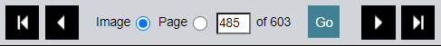

* For each flimsy slip, enter the image number given in the Wellcome Library or Wellcome Collections website Viewer toolbar.
* If you are transcribing from a PDF, the image number is the page number minus 1.

### Sub number

* This is only required where **more than one row** is required for a flimsy slip 
* Or where there are **several cards representing one A number**, as explained in the general transcription instructions. _Leave blank in all other cases._

### R number

Registration \(‘R’\) numbers are sometimes written under or to the right hand side of A numbers. They can also appear in the middle of the flimsy slip. Similarly to the A number, they may appear with an R prefix but more commonly without.

#### R numbers can take one of two forms:

* An R running number \(e.g. 12345\)
  * Note that written without a prefix, this style of R number is easily confused with an A number, but **will always be the bottom or second number written on the slip**.
* An R-date number \(e.g. 4168/1937\). 
  * This example means that the object was the 4168 object registered in 1937. 
  * In some cases the R-date number can appear elsewhere on the slip, such as within a stamp.
  * You may also see the R-date number written in reverse \(e.g. 1937/4168\), with an abbreviated year form \(e.g. 4168/37\), and with commas or apostrophes used in place of / \(e.g. 4168’37\).
    * Please transcribe all R-date forms in full with the year last i.e. R4168/1937. 
    * You can assume all the years referenced by R-date number are in the **twentieth century**, i.e. 19xx.

When transcribing in this column, **please always add the prefix ‘R’ before the number**.

#### ¡ **Important note: More than one R number** !

You will occasionally encounter flimsy slips which record an A number, an R running number _and_ an R-date number for the same object. In this case, **please record both references**, separated by a semi-colon and space, e.g. R1234; R56/1951.

#### ¡ **Important note:** Range of R numbers !

You will also come across a _range_ of R numbers for multiple items on one flimsy slip. Please make sure to enter each one within the range. E.g if you see R45826-7 then fully list them R45826; R45827; R45828… etc. **separated by a semi-colon**.

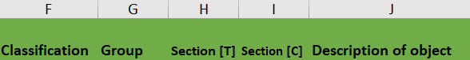

### Classification

* Enter the classification as it appears on the slip. E.g., QQ, CCC, M etc. or leave blank as appropriate.
* If you are confused about classification codes, check the classification codes sheet in the files section of the teams group:

### Group

Enter any text that appears in the ‘Group’ section of the slip. In almost all cases though, this field is blank.

### Section \[T\]

* These codes are for the _TYPE_ of object
* Transcribe the type of the object in column I.
* These take the form of an abbreviation: VES \(Vessel\), COS \(Costume\), AW \(Arrows\), AM \(Amulet\) etc. 
* In some cases, there will be more than one type, which should be separated by a semi-colon in your transcription. 
* **Please note that the abbreviations used may represent insensitive or outdated terminology which you may find uncomfortable. Please transcribe the abbreviation as written on the flimsy slip.**

### Section \[C\] 

* These codes are for place of origin \(culture\) 
* Transcribe the abbreviation in column J. 

### Section codes & meanings

**If you are confused about any classification, nationality \(Section \[C\]\) or Type \(Section \[T\]\) codes and can't decide which column they should go into, please check out the lists available in the WHMM codes folder found under the Museum Index Cards channel's file section.**

### Description of object 

* Enter the description of the object\(s\) in this column, exactly as written on the flimsy slip 
* _Except_ when the slip describes multiple objects which can be clearly separated out onto separate rows, please use separate rows for each object and remember to add **sub numbers.**

#### Ditto

* If a slip uses ‘ditto’ or ‘do’ in the description, replace ‘ditto’ with the description from the object above. unless you are unsure of what the ditto represents, then transcribe exactly as seen.
* **Example**: the 2nd row for the flimsy slip describing ‘Red pottery vase 12th Dynasty. 10" high. 4" diameter. Ditto 11" high. 3" diameter’ would read ‘Red pottery vase 12th Dynasty. 11” high. 3” diameter’.

#### Fractions

* Transcribe fractions \(e.g. in measurements\) using Insert – Symbol and selecting the correct proper fraction. If you encounter difficulties in finding the correct symbol, record this in the **transcriber’s notes \(column V\)**.
* The following are keyboard shortcuts that can be used instead of the insert method: 
  * **Alt + 0188 = ¼** 
  * **Alt + 0189 = ½** 
  * **Alt + 0190 = ¾**
* All other fractions **need to be written out** as e.g. 5/8
  * Remember to put a space _before_ you write out the fraction e.g 3 5/8" 
* Sometimes the description continues on the back of the slip, please put this in description.
* Some slips include the lot numbers or value - transcribe these in **Columns L** and **M**. 

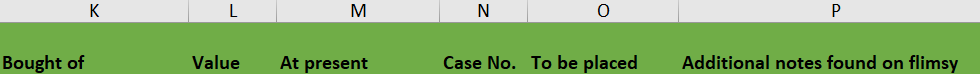

### Bought of

Transcribe the acquisition details, which usually appear in the slip under ‘bought of’, exactly as written on the flimsy slip.

### Value 

* Enter the acquisition value of the object in this column, exactly as written on the flimsy slip.
* If there are multiple values if a slip has more than one object, transcribe the corresponding value for each object in its own row. If you can't discern this, put an unsure note in transcribers notes.
* If you come across non-pound sterling currencies, simply transcribe other currencies as they are written e.g. 36l.

### At present 

* Anything recorded in the ‘at present’ field should be transcribed here, exactly as written on the flimsy slip. 
* This may refer to objects transferred to the Wellcome Research Institute, or dispersed to other museums. For example, ‘To WRI 18 X 37’ means that the object was transferred to the Wellcome Research Institute on the 18 Oct 1937.

### Case No. 

* Enter the case number here. 
* Sometimes more than one will be recorded; separate different case numbers with a semi-colon.
* Others may be scored through and replaced with a new one. In this case, [show the old number scored through in this column.](https://app.gitbook.com/@wellcomecollection/s/transcribe-wellcome/~/drafts/-MVX8pRWCDwKs0LJB2xG/transcription-guidelines/museum-flimsy-slips#crossed-out-writing)

### To be placed

Transcribe any text or letters under the ‘To be placed’ heading, exactly as written on the flimsy slip. In most cases, this heading will be empty on the slips and blank on the transcription.

### Additional notes on flimsy 

* Use this column to enter, **exactly** as written, anything **on the slip** that does _not_ fit into other columns.
* Do not put your own notes in this column. If you need to add notes e.g there is a drawing, put it in transcribers notes.

## Blue Column Headings

In addition to transcribing text exactly as written on the flimsy slips under the green column headings, transcribers should also extract acquisition date and \(where relevant\) auction house and lot numbers into a standardised format.

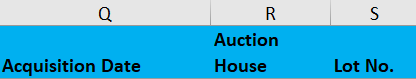

### Acquisition Date

Transcribe acquisition dates according to the following instructions:

* Enter an exact acquisition date where this is written on the flimsy slip \(usually already transcribed in **Bought of \(column L\)**\) in the format DD-Month-Full Year. e.g. 22 January 1929.
* Where the date written on the flimsy slip is given **only as a month**, **year**, or **span of days**, enter the latest date at which the object\(s\) can have been acquired. Examples are as follows:
  * Month and year: **August 1952** should be entered as **31 August 1952**
  * Year only: **1924** should be entered as **31 December 1924**
  * Span of days: **17-20 January 1930** should be entered as **20 January 1930**.
* For dates in February, you may find [this list of leap years 1800 - 2400](https://kalender-365.de/leap-years.php) useful.
* If there is a date in an accession department **stamp** and no other date, enter that date
* Leave the field **blank** where **no date at all is written** on the flimsy slip **unless** the date of acquisition can be reasonably assumed from other contextual evidence \(e.g. adjacent flimsy slips recording objects acquired from the same source\).

If you have to normalise the dates as explained above, **leave a note in transcribers notes saying "Acquisition date normalised."**

### Auction House 

In many cases, the acquisition will be an auction purchase - e.g. **Soth. 6 & 7/12/20 Lot 196** refers to lot 196 sold at Sotheby’s during the sale held on 6th and 7th December 1920. 

Sometimes the lot number appears before the date, and the month may appear in Roman numerals \(Soth. 91/1/XII/30\).

These abbreviations can expanded using the list below. Select the relevant auction house from the dropdown list in column R.

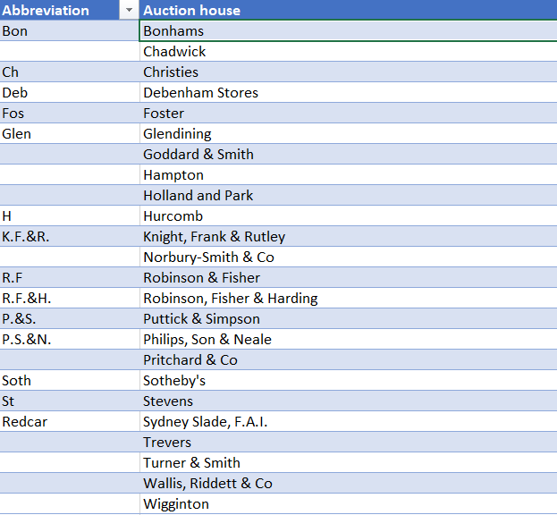

A list of the current known auction houses can be seen in the 'Auction House' tab at the bottom of your sheet.

### Lot No. 

Enter the lot number, if applicable, in this column. When a slip describes multiple items, these are often recorded next to each object \(when different lot numbers\) and should be entered on separate rows as explained in the [general transcription instructions](https://app.gitbook.com/@wellcomecollection/s/transcribe-wellcome/~/drafts/-MV_dz6oswYW2yuSHFdq/transcription-guidelines/museum-flimsy-slips#more-than-one-object).

## Yellow Column Headings

### Transcribed By 

Your email address e.g. j.bloggs@wellcome.org

### Transcriber’s Notes 

* Use this column to record any additional notes. For example, if the slip is accompanied by a letter or extensive notes not transcribed in ‘Description of object’, there is a drawing, the slip is double sided etc.
* Also use this column to note any problems you have had with the transcription. [Prefix this note with ‘Unsure’ followed by an explanation](https://app.gitbook.com/@wellcomecollection/s/transcribe-wellcome/~/drafts/-MV_hg8EJdv6gx0T8d8v/transcription-guidelines/museum-flimsy-slips#unsure-about-something) e.g. ‘Unsure: cannot read last digit of accession number’.
* If you have made a remark that relates to more than one accession, please make sure you add it into every relevant **Transcriber’s Notes** column. Do not use the phrases ‘see above’ or ‘see below’ in any column, each row needs its own note.

### Creative Commons Licence

This column assigns the CC0 terms to each row of transcribed data. Do not edit.

## Red Column - Sensitivity

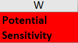

This column has a drop down list to select 'Y' for Yes. This is in case you come across any particularly offensive/derogatory language that you feel should be flagged. If you feel that this is the case, please select Y and leave a note in transcribers notes.

## Upon completion

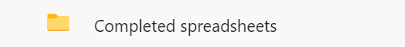

Please upload your file **to Grp\_Wellcome Transcribers** on Microsoft Teams. At the top of the group’s page you will see a **‘Files’** tab. In that tab you will see a **‘Completed Spreadsheets’** folder, please upload your file there.

Once you’ve done this please leave a message in your respective channel that you’ve uploaded your sheet.

#### **Version 4.0**

<table>
  <thead>
    <tr>
      <th style="text-align:left"><b>Document</b>
      </th>
      <th style="text-align:left"><b>Date</b>
      </th>
      <th style="text-align:left"><b>Notes</b>
      </th>
    </tr>
  </thead>
  <tbody>
    <tr>
      <td style="text-align:left">Version 1.0</td>
      <td style="text-align:left">28/04/2020</td>
      <td style="text-align:left">First version published</td>
    </tr>
    <tr>
      <td style="text-align:left">Version 2.0</td>
      <td style="text-align:left">19/05/2020</td>
      <td style="text-align:left">
        
Updates to:

        <ul>
          <li>Filename structure changed</li>
          <li>Note for non-Latin script</li>
          <li>Note for gaps in accession numbers</li>
          <li>Note about adding in Wellcome email instead of name</li>
          <li>Note about unable to transcribe a letter or word</li>
          <li>Fraction shortcuts and guidance</li>
          <li>Stylistic changes</li>
          <li>Hidden columns</li>
          <li>Upload procedure</li>
        </ul>
      </td>
    </tr>
    <tr>
      <td style="text-align:left">Version 3.0</td>
      <td style="text-align:left">01/07/2020</td>
      <td style="text-align:left">
        
Updates to:

        <ul>
          <li>Explaining how to use transcription team group on Microsoft Teams</li>
          <li>Duplicate A numbers</li>
          <li>Tagging instructions</li>
          <li>Transcribers notes column clarification on multiple entries</li>
          <li>Acquisition and Accession definitions</li>
          <li>Normalisation of acquisition dates</li>
          <li>Readjustment of placement of version history table</li>
        </ul>
      </td>
    </tr>
    <tr>
      <td style="text-align:left">Version 4.0</td>
      <td style="text-align:left">07/10/2020</td>
      <td style="text-align:left">
        
Updates to:

        <ul>
          <li>CC0 licence agreement and column description</li>
          <li>Description of Visual Material Registers channel on Teams</li>
          <li>Addition to General transcription notes - pencil notations, question marks,
            unsure, sketches</li>
          <li>email address changed to .org in Transcribed by Column</li>
          <li>Additional notes column &#x2013; stamp structure and how to enter other
            notes</li>
          <li>R numbers &#x2013; how to transcribe a range</li>
        </ul>
      </td>
    </tr>
  </tbody>
</table>

