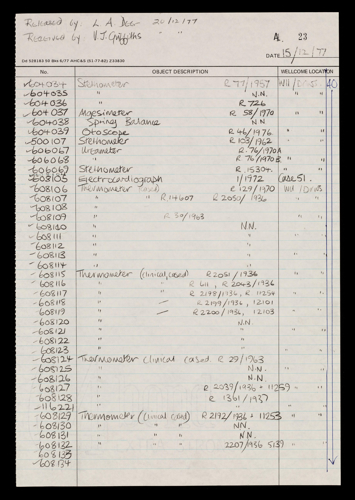

# Science Museum Transit Registers

## The Transcription Spreadsheet

The column headings in the transcription spreadsheet correspond - broadly - to the headings used in the transit register, plus some additional columns linking your transcription to the digitised archive record \(and for notes\). 

As working documents, the transit registers are heavily customised and annotated, and columns may sometimes appear in the registers in a different layout to that set out in the transcription template. 

## General Transcription Instructions

Each row of the transit register should be transcribed onto one row of the spreadsheet.

Wellcome object identifiers are inconsistently recorded in the transit registers. When transcribing these identifiers, please transcribe _without_ prefix i.e. `R1234` should be transcribed into the **Old R number** column as just `1234`. 

`NN` \(meaning 'no number'\) should be transcribed into **transcriber's notes**. 

If the register uses `ditto` or `" "` \(or similar\), transcribe the relevant information in full in each row. Do not transcribe as written. 

## Green Column Headings

### **A number** 

Transcribe the accession \('A number'\) for each object from the left hand column of the transit register \(headed 'No.' in the register\) onto a new row in the spreadsheet:

A numbers are integers of up to 6 digits in length. 

Do not include the A prefix, even if this is written in the transit register. 

### Object Description

Transcribe the object description from the column headed 'object description' in the transit register. But do not include any registration numbers written into this column in the register.

### Old R number

Transcribe the 'old registration number' for the object, without prefix.

Old registration numbers are integers of up to 5 digits in length. 

Do not include the R prefix on the spreadsheet, even if this is written in the transit register.  i.e. `R1234` in the register should be transcribed as `1234` in this column in the spreadsheet. Please transcribe any number suffixes \(e.g. `A-F`\) separately into **transcriber's notes**. 

Be aware that individual objects may have an old registration number, a new registration number or both. Be careful to enter these into the correct column of the spreadsheet. 

### New R number

Transcribe the 'new registration number' for the object, without prefix.

New registration numbers consist of 4 or 5 parts:

* a prefix \(which is always `R` in the transit registers\)
* an integer of up to 5 digits in length
* a divider \(usually written as `/` in the transit registers, but sometimes `-` or `'` are used instead\)
* a year \(usually - but not always - written as 4 digits\). This should always be transcribed as a full 4 digits
* \(optionally\) a suffix, usually alphabetical e.g. `A-G`

Here are some further examples of new registration numbers as you may encounter them in the transit registers:

| Written in transit register | Transcribe as: |
| :--- | :--- |
| R1234/1938 | 1234/1938 |
| 6-1964 | 6/1964 |
| 14057/1936 | 14057/1936 |
| R'67-492 | 492/1967 |

For the purposes of transit register transcription, all new registration numbers should be transcribed _without_ prefix but with the year written in full i.e. `1234/1938`. Please transcribe any number suffixes \(e.g. `A-F`\) separately into **transcriber's notes**. 

Be aware that individual objects may have an old registration number, a new registration number or both. Be careful to enter these into the correct column of the spreadsheet. 

### Box Number

Transcribe the box or case number exactly as written in the transit register. This is not a printed heading but has been added as an additional column on most pages of the registers. 

### Wellcome location

Transcribe the Wellcome Location exactly as written in the transit register. This may be either a gallery or a stores location. Do not include any box number details already transcribed into the box number column. 

## Yellow Column Headings

### Transcriber's Notes

Please use this column to record any additional notes, or to note any problems you have had with the transcription. 

`NN` \('no number'\) should also be noted in this column. 

If you have a note that relates to more than one entry, please make sure you add it into every relevant row of the spreadsheet and avoid the use of the phrases 'see above', 'see below' or 'ditto' in any column. 

### Transcribed By

Your email address e.g. j.bloggs@wellcome.org

## Blue column headings

### Image Number

Enter the image number for the page of the transit register. This can be found at the top middle of the top middle of the image viewer window to the left of the '/'. 

Alternatively, if you are transcribing from PDF, the image number is the PDF page number minus 1 \(because of the cover sheet added to the PDF\). 

### Wellcome archive reference

Enter the reference for the transit register in the Wellcome archive e.g. `WA/HMM/TR/Abc/A.1/1`. This will be the same for every entry in each batch of transcription. 

### Licence

Enter `CC0` for each entry.

