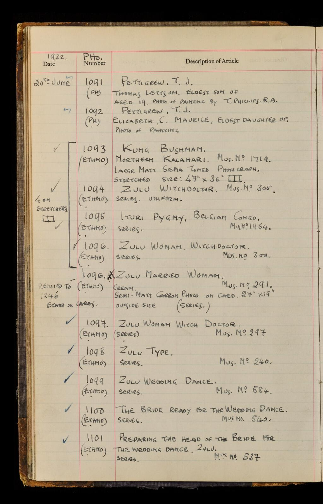

# PHO Accession Registers

!\[A close up of text on a white background

Description generated with very high confidence]\(<../.gitbook/assets/1 (1).png>)

!\[A close up of text on a white background

Description generated with very high confidence]\(<../.gitbook/assets/2 (1).png>)

## The Transcription Spreadsheet

The column headings in the transcription spreadsheet correspond – broadly – to the headings printed on the Visual Material Accession Registers, plus some additional columns for recording details which may be useful for future data analysis and online search. It is indicated in the column heading instructions if, and where, headings differ between spreadsheet and Register.

The style of the Accession Registers changed over time, and according to the purpose for which they were used by Wellcome Historical Medical Museum, and some headings were rarely used. Fields on the spreadsheet may be hidden for these headings if not relevant to the set of entries you have been assigned.

## General transcription instructions

Generally, each accession entry (unique number) will be transcribed onto **one** row of the spreadsheet.

For the majority of columns, you will be asked to transcribe the information exactly as it appears on the page. For some columns you will be required to transcribe the information into a standardised format e.g. date of accession. This is to assist future research and will be made clear in the individual instructions.

### Scored through text:

For any text which has been scored through, do the same in the transcription. If you do use the strikethrough, or any other formatted text, you must use the appropriate tagging e.g. \<s>\[transcribed text here]\</s> or \<i>\[transcribed text here]\</i> for italics.

### Gaps in the sequence:

You may notice gaps in the accession numbers, this is normal. Please continue to work with the numbers taken from the Registers.

### Duplicate accession numbers:

Any duplicate accession numbers should be added to the bottom of your spreadsheet with comments in the **Transcriber’s Notes (Column T)**. As duplicate accession numbers require extra checks before importing, please highlight these rows with a colour so that they can be identified easily.

### Multiple objects on similar or sharing the same support:

You may come across multiple entries which have been grouped together on the Register e.g. photographs sharing a support at the time of registration or laid on similar supports/backings.

See example below:

PHO1093-1096 from WAHMM/IC/1/10, [PHO 886-2332](https://wellcomelibrary.org/item/b29490005) (image 46)

<figure><figcaption>
Image 46
</figcaption></figure>

Please do transcribe them in separate lines and add the same note to each photograph, in the ‘Transcriber’s Note’ field e.g. ‘_PHO1093: Photograph on stretcher, same as PHO1094-1096_’.

### Deciphering the Registers:

If you cannot decipher the handwriting, use \[.] to indicate an indecipherable letter e.g. _gl\[.]ssy bro\[.]ide_. The number of dots = number of missing letters. Use \[?] if you have guessed at a letter or word e.g. _Spectator_\[?]. If there are square brackets, question marks or dots in the Register already, add a note to the **Transcriber’s Notes** i.e. The square brackets in the description column are in the original document.

If you encounter any problems identifying words, letters or symbols head to the Transcribers’ Group on Microsoft Teams. There may be others who have asked or answered the same questions. A quick google search may also help with artist’s names and places for instance, but the search results should never take priority over the text on the Register page.

**Important Note:** From PHO 1994 in Register 10, we notice a change in handwriting, which becomes non-capitalised and slightly more challenging to decipher. This handwriting is maintained across all registers, from this entry to the last PHO Register 24. Please allow your eyes and brain to get acquainted with the new handwriting. It should become easier to decipher the text after about 10 entries, as you become more and more familiar with the characters.

### Non-Latin Characters:

If you notice anything is written in non-Latin script make a note in the **Transcriber’s Notes** and, if you cannot discern or transliterate it, please put \[…].

### Accented Characters:

All Latin characters with accents should be transcribed by inserting the correct symbol e.g. Â.

PHO registers in particular, present a significant amount of information written in different languages, such as French, which makes a wide use of accents. Please make sure that you transcribe the correct symbols. You can simply use the Excel function clicking on the ‘Insert’ tab at the top and then ‘Symbol’. You will find the most common characters with accents under the ‘Latin-1 Supplement set’. As an alternative you can use shortcuts as listed in the table below. Just press **Alt** + three-digit number in the Number keyboard to get the accent mark character.

!\[A screenshot of a cell phone

Description generated with high confidence]\(../.gitbook/assets/12.png)

### Fractions:

Transcribe fractions (e.g. in measurements or often used in PHO Registers to describe a particular portrait view e.g. ‘¾ view’) using Insert – Symbol and selecting the correct proper fraction. If you encounter difficulties in finding the correct symbol, record this in the **transcriber’s notes (column T)**.

The following are keyboard shortcuts that can be used instead of the insert method:

**Alt + 0188 = ¼** **Alt + 0189 = ½** **Alt + 0190 = ¾**

All other fractions need to be written out as e.g. 5/8, remembering to put a space beforehand, i.e. 3 5/8" because the symbols available in Excel aren't widely interpreted outside of Microsoft word (so get replaced by squiggles when we import the spreadsheets into Quickbase). This applies to more complex and less common fractions, which should also be written as follows: 5/16’’ and 13/16’’.

### Ditto:

If the register uses ‘ditto’ or ‘//’ in the columns, replace ‘ditto’ with the information from the row above e.g. if one row has the title ‘Medicine-man’ and the row below has ‘// // curing patient’, the description of the second object should be transcribed as ‘Medicine-man curing patient’.

### Abbreviations:

You are not expected/required to expand abbreviated words e.g. Imp\[erial]. Simply transcribe the abbreviation as it appears on the page and, if you can identify the word, add a note to the **Transcriber’s Notes**. If you have larger problems reading the text on the slips, or are unsure of anything, please also note this in the **Transcriber’s Notes** column.

### Blank fields:

Apart from the **Date of Accession (Column A)** leave any blank spaces blank. Blank spaces and columns are common in the Registers and do not need noting.

### Artist’s names:

Artist’s names should always be transcribed as seen on the Register. Even if the name is incorrect or abbreviated and you have knowledge of the correct or full name, please transcribe the text as it is in the description field and also in the artist/photographer field. You can always provide additional information in the Transcriber’s Note field. See examples below:

\- If in the description you have ‘_Photo by Nadar_’, please type ‘_Nadar_’ in the Photographer column. You may want to note the full name ‘_Félix Nadar_’ in the ‘Transcriber’s Note’ field, keeping in mind this is not required.

\- If on the VM Register or Registration Cards you find ‘_Oil painting by Salamon’_, and you know this could be artist ‘_H.H. Salomon’_, you may want to use the ‘Transcriber’s Note’ column to make the suggestion, possibly with some reference. Please keep in mind this is not required.\
E.g. ‘Artist could be Salomon, Harry Herman, incorrectly typed Salamon on registration card? [https://artuk.org/discover/artists/salomon-harry-herman-18601936](https://artuk.org/discover/artists/salomon-harry-herman-18601936)’.

### Capitalisation of text:

Some of the Registers are entirely written in capitalised text. If you can, please avoid capitalising all text in your transcription spreadsheet as it could make readability slightly harder. If it works for a particular register, you could keep the first part of the description capitalised (e.g. name of the doctor portrayed) transcribe the remainder using standard lower-case characters. Please see example below:

PHO294 from WAHMM/IC/1/9 [Accession register, PHO 1-885](https://wellcomelibrary.org/item/b29490078) (image 108)

!\[A close up of text on a white background

Description generated with very high confidence]\(../.gitbook/assets/13.png)

Will be transcribed as follows:

!\[A close up of a logo

Description generated with high confidence]\(../.gitbook/assets/14.png)

**Definitions for general reference:**

* **Acquisition date –** When the item/object/record was _acquired_ e.g. the date it was bought at an auction
* **Accession date –** When the item/object/record was accessioned _into_ the collection
* **Registration date –** When an item was recorded on Registers and assigned a new number (R no.). Usually this date is later than the acquisition date (an item was sometimes registered many years after it was acquired). R numbers were usually assigned to important material intended for display.

Please note: Registration stops between 1933-35. From 1935 we see a new registration system (R Year), which works alongside Acc. No., and R no. (old system).

**Visual Material Registers are complicated and rarely show identical features or headings. For this reason, the following guidelines have been organised in different sections, each one referring to a specific type of Registers**.

## PHO REGISTERS (Photographs)

Series of 16 bound registers (WA/HMM/IC/1/9-24), containing entries for photographs accessioned as part of the former iconographic collection, from 1928 to 1987. These registers were begun by Daniel Pender-Davidson in December 1928. The sequence is continuous until 1987. Negative numbers noted in these registers usually refer to Wellcome Images (M sequence).

### PHO Column Headings

Yellow headings: These headings correspond broadly to the headings printed in the PHO Accession registers.

**Blue headings:** Additional columns for recording details which may be useful for future data analysis and online search. These require some interpretation.

#### Date of Accession (column A):

The ‘date of accession’ is listed in the first column of the PHO Registers, under the heading ‘Date’. Always transcribe the date in full in the order of dd-month-full year e.g. 06 May 1930. The column should be already formatted with the correct date format, which will transform any values in a full date, however please always double check the formatting is working.

Even if the date column is blank or if there are no ditto marks, assume that multiple items were added to the Register on the same day.

To aid filtering and analysis, if several consecutive dates are given, enter the **latest** day that these items were accessioned e.g. 6-9 January 1931 should be entered as 9 January 1931 with a **Transcriber’s Note** saying, ‘Accession date normalised to last day of entry’. If the date of accession is recorded as only a month or a year, provide the last possible date the accession may have occurred e.g. September 1928 should be entered as 30 September 1928 with the same **Transcriber’s Note**. For dates in February, you may find [this list of leap years 1800 - 2400](https://kalender-365.de/leap-years.php) useful.

If you come across **no accession date** in your assigned batch of accessions, please go back to the previous image to see what the most recent accession date is and use this assumed date as your accession date and **make a note of this in the transcribers note.** E.g “No accession date listed, used most recent accession date.” Only do this if your _entire_ batch is lacking an accession date, _not_ if there is a date at the top and then blanks underneath.

If you come across a purchase/acquisition date, **please use that instead**, and again enter a transcriber’s note that you have done so. E.g _“Accession date not available, purchase date used instead.”_

#### PHO Number (column B):

Transcribe each PHO number in this column. There is no need to prefix the numbers with PHO. If you come across an accession number which is out of sequence, please add this to the bottom of your spreadsheet and add a note to the Transcriber’s Note (Column S).

**Important note:** If you come across a PHO number for which you have a duplicate, or a number which is outside your allocated sequence, please transcribe these at the bottom of your spreadsheet, adding the relevant PHO number into column B.

\*Please see instructions on ‘[Classification’](broken-reference/) for details on how to transcribe the letters in brackets usually found below the PHO No.

#### Other Number/s (Column C):

Any additional identification number, other than PHO and Neg. Nos. should be transcribed in this column, with their prefix and with no punctuation or space in between prefix and number, even when punctuation appears on the Register. This column doesn’t correspond to a particular heading from the register, but it has been added to record details which may be useful for future data analysis and online search. Please see example below:

PHO171 from WAHMM/IC/1/9 [Accession register, PHO 1-885](https://wellcomelibrary.org/item/b29490078) (image 108)

!\[A close up of text on a white background

Description generated with very high confidence]\(../.gitbook/assets/15.png)

In the Other Number/s column we will transcribe as follows:

!\[A picture containing bird, drawing

Description generated with very high confidence]\(../.gitbook/assets/16.png)

Additional CC identification numbers are common in PHO registers, as well as ‘Mus. No.’ (appearing from Register 10). CC numbers were normally used for Paintings and some prints and drawings and were introduced by Daniel Pender-Davidson and continued by others until 1935. These will often be found in the article description field and may refer to a painting in the collection that has been photographed.

Please do transcribe additional identification numbers in this column even if it’s clear they are a reference to a separate object. E.g. ‘see P.R.2865’ in the ‘Description of Article’ field, means the object is a photograph of a print identified as PR2865. See example below:

PHO162 from WAHMM/IC/1/9 [Accession register, PHO 1-885](https://wellcomelibrary.org/item/b29490078) (image 56)

!\[A close up of text on a white background

Description generated with very high confidence]\(../.gitbook/assets/17.png)

PR2865 will be transcribed in the Other Number Column, without the word ‘see’.

In the ‘Transcriber’s note’ field, you could specify whether it is your understanding that the PR number refers to a separate item.

If more than one additional identification number is present, please transcribe all of them separated by a semi-colon ‘;’.

e.g CC5294; CC5296.

Please make sure that you transcribe the prefix, (for example CC), with capital letters and with no space between the letters and the number.

#### Register (Column D):

This column does not require transcription and may be hidden. Please note: other columns in the spreadsheet may be hidden if they are not applicable to a specific register.

#### Image No./Rh image No.(Column E/F):

For each accession number, enter the image number given in the Wellcome Library website Viewer toolbar. If you are transcribing from a PDF, the image number is the page number minus 1.

The ‘Image number’ column applies to the first line of transcription for that PHO number and the ‘RH image number’ to the adjoining page, where usually information on ‘Obtained from’ and ‘Cost’ are held. If you come across a blank page, please double check what image number you are recording in the next dataset.

#### Classification (from PHO no. heading) (Column G):

In the PHO registers, under PHO number, you will often find some letters in brackets I.e. PHO 218 (PH). The letters in brackets form part of a key to the subject classification of the item. PH – stands for Photo, POR stands for portrait and there are many others. In this instance we do not want you to transcribe the subject classification in the PHO no. field. Please do transcribe this directly into the ‘Classification’ column but without using brackets. If there is more than one classification recorded, please record both but separate with a semi colon.

#### Description of Article (Column H):

This column reflects exactly the heading on the Registers, except for Register 24 where the heading is simply named ‘Description’. Enter the description of the object(s) in this column, exactly as written on the Register. (Although please only capitalise the title as mentioned in capitalisation of text guidance)

* If the register uses ‘ditto’ or ‘//’ in the columns, replace ‘ditto’ with the information from the row above e.g. if one row has the title ‘Medicine-man’ and the row below has ‘// // curing patient’, the description of the second object should be transcribed as ‘Medicine-man curing patient’.
* Transcribe fractions (e.g. in measurements or often used in PHO Registers to describe a particular portrait view e.g. ‘¾ view’) using Insert – Symbol and selecting the correct proper fraction. If you encounter difficulties in finding the correct symbol, record this in the **transcriber’s notes (column T)**.

The following are keyboard shortcuts that can be used instead of the insert method:

**Alt + 0188 = ¼** **Alt + 0189 = ½** **Alt + 0190 = ¾**

All other fractions need to be written out as e.g. 5/8, remembering to put a space beforehand, i.e. 3 5/8" because the symbols available in Excel aren't widely interpreted outside of Microsoft word (so get replaced by squiggles when we import the spreadsheets into Quickbase).

* In the PHO registers you will frequently come across a + sign which has been used in place of the word ‘and’ please transcribe as a +.
* PHO registers in particular, present a significant amount of information in other languages, which uses accents. Please make sure that you transcribe the correct symbols. You can simply use Insert – Symbol and select the correct accented character. You will find the most common characters with accents under the ‘Latin-1 Supplement set’. As an alternative you can use shortcuts as listed in the table at the beginning of this document under ‘[Accented Characters’](broken-reference/). Just press **Alt** + three-digit number in the Number keyboard to get the accent mark character.
* Some of the Registers are entirely written in capitalised text. If you can, please avoid capitalising all text in your transcription spreadsheet as it could make readability slightly harder. If it works for a particular register, you could keep the first part of the description capitalised (e.g. name of the doctor portrayed) and transcribe the remainder using standard lower-case characters

**Important note:** If you notice anything is written in non-Latin script and you cannot discern or transliterate it, please put \[…]. Please make a note that you have come across non-latin script in column T’s ‘Transcriber’s notes.’

**Important note:** If there is anything you cannot read and posting about it in Microsoft Teams does not help either, please put \[?] in the place of a single letter or entire word and make sure to make note of this in column V’s ‘Transcriber notes’.

* We came across a number of scenarios where the ‘Description of Articles’ is continuing across the next page, more specifically under the ‘Obtained from’ heading. See example below:

!\[A close up of text on a white background

Description generated with very high confidence]\(../.gitbook/assets/18.png)

!\[A close up of a map

Description generated with high confidence]\(../.gitbook/assets/19.png)

Please transcribe the final section of the ‘description of article’ (from the ‘Obtained from’ heading) in square brackets and add a note in the Transcriber’s Note field. See example below:

!\[A screenshot of a cell phone

Description generated with high confidence]\(../.gitbook/assets/20.png)

If the description is particularly long and they have continued in the correct field, but in the next register’s page, please do transcribe normally and add a note in the Transcriber’s Note field. E.g. ‘PHO 89 continues on to image pages 36 and 37…’.

* Should you come across text containing sensitive or offensive language, please do transcribe as it as and then add a note in the ‘Transcriber’s Note’ field using the following format: ‘Sensitivity note: subject classification 'Freaks'.

#### Negative No.(Column I):

This column doesn’t correspond to a particular heading from the register, but it has been added to record details which may be useful for future data analysis and online search.

Negative numbers can occasionally be found either in the ‘Description of Article’ or ‘Obtained from’ fields. Please do transcribe them under the heading they are written in, as well as adding them to the ‘Negative No.’ column. In this column you are required to simply transcribe the number without any prefix.

Object Name:

This column doesn’t correspond to a particular heading from the register, but it has been added to record details which may be useful for future data analysis and online search. This information is usually placed in the ‘Description of Article’ field (except for Register 10 where ‘X-ray’ is found in the ‘PHO No.’ field and it is also the ‘Classification’).

This list includes narrow as well as broader terminology, including the more generic ‘Photographic Prints.’ Please use this term if you are unsure about the photographic technique, this is not clear from the description or if you come across a term that doesn’t exist in the drop-down list. You can only choose one value from the drop-down list. For groups of photographs including different techniques, please do select ‘Photographic Prints’.

Full list as follows:

| Photographic Prints                           |
| --------------------------------------------- |
| Photographic Prints - Albumen                 |
| Photographic Prints - Bromide                 |
| Photographic Prints - Carbon Print            |
| Photographic Prints - Collotype               |
| Photographic Prints - Daguerrotype            |
| Photographic Prints - Gelatin Silver          |
| Photographic Prints - Heliograph              |
| Photographic Prints - Photogravure            |
| Photographic Prints - Radiograph (X-Ray)      |
| Photographic Prints - Salt                    |
| Photographic Prints - Wet Collodion Negatives |
| Photographic Prints - Woodburytype            |

**Important note:** we have tried our best to identify and include most of the techniques mentioned in the ‘Description of Article’ in the PHO registers. However, it is possible that you would come across terms that are not in the list. If this happens as an exceptional scenario, please do select ‘Photographic Prints’ instead. Otherwise, should this term appear several times in the Register, please do get in touch with the Project Team using the relevant channel on Teams, so we can add the new technique to the drop-down list.

We are not asking transcribers to be or become experts in historical photographic processes, and this knowledge, as well as being quite specialist and difficult to acquire in a short amount of time, is not REQUIRED. However, please find below a few tips and brief explanations of scenarios that you will encounter more frequently and a few links to resources available online. Remember, if in doubt you always have the option to select the more generic term ‘Photographic Prints’.

**Important Note:** You will find that the majority of the descriptions include quite specific information about the photographic process, particularly for ‘Bromide’ photographs. Please do select the value ‘Photographic Prints: Bromide’ in the object name column, ignoring additional details such as ‘matt’ or ‘glossy’. Please do transcribe the full description as usual, in the Description of Article’ field.

**Important Note:** Often you will come across items described as ‘Sepia’ prints e.g. ‘Whole plate sepia matt’ or ‘Semi-matt sepia tone’. Sepia is not a photographic process but **a form of photographic print toning** – a tone added to a black and white photograph in the darkroom to “warm” up the tones (though since it is still a monochromatic image it is still considered black and white). Sepia began in earnest in the 1880s, partially to make photographs look better, but also because the chemicals involved in Sepia aided in slowing down the aging of a photograph. This toning can be applied to a variety of photographic processes. Unfortunately, not in all cases is the process specified and it is limited to the toning of the photograph. We have added an additional value ‘Photographic prints – Sepia’ in the drop-down list for this type of photographs to facilitate the work of Transcribers. Should you come across a photograph that is described as ‘Sepia Bromide’, the actual process, in this case ‘Bromide’, should have priority on ‘Sepia’ and you should pick ‘Photographic Prints – Bromide’. If in doubt just select the more generic term ‘Photographic Prints’.

A brief selection of resources on historical photographic processes available online, is included below:

[https://www.vam.ac.uk/articles/photographic-processes](https://www.vam.ac.uk/articles/photographic-processes) A very clear but exhaustive guide to Photographic Processes by V\&A.

[https://www.npg.org.uk/collections/explore/glossary-of-art-terms/bromide-print](https://www.npg.org.uk/collections/explore/glossary-of-art-terms/bromide-print)

[http://www.cycleback.com/photoguide/index.html](http://www.cycleback.com/photoguide/index.html) The book ‘_Judging the Authenticity of Photographs_’ covers the essentials to identifying, dating, understanding and authenticating photographs from the origins in the 1800s to today. Topics include identification of **photo processes**, dating styles, identifying images made from the original negatives, stamps and tags, identifying fakes and reprints, and more.

[http://www.ntm.cz/projekty/fototechniky/en/](http://www.ntm.cz/projekty/fototechniky/en/) a very detailed database by the National Technical Museum in Prague.

#### Photographer (if known)(Column K):

This column doesn’t correspond to a particular heading from the register, but it has been added to record details which may be useful for future data analysis and online search.

Often you will find the name of the photographer included at the end of the ‘Description of Article’, e.g. ‘Photo by Nadar’. Please do transcribe this information as it is in the ‘Description of article’ field, as well adding the name exactly as it is written on the Register, in this specific column.

Photographer’s names should always be transcribed as seen on the Register. Even if the name is incorrect or abbreviated and you have knowledge of the correct or full name, please transcribe the text as it is. You can always provide additional information in the ‘Transcriber’s Note’ field. E.g. If the Description mentions ‘Photo by Nadar’, please type ‘Nadar’ in the Photographer column. You may want to note the full name ‘Félix Nadar’ in the Transcriber’s Note field, keeping in mind this is not a requirement.

If you notice incorrect spelling of a Photographer’s name e.g. ‘Photo by Lafayett’, and you are aware the correct name should be ‘Lafayette’, you may want to use the ‘Transcriber’s note’ column to suggest this possibility.

**Important note:** Please do not transcribe in this column the name of painters/engravers etc. who made the original painting/engraving etc. from which the photograph is taken from. This column should only be used to record the name of the actual maker of the photograph.

**Important note:** A quick google search may also help with artist’s names and places for instance, but the search results should never take priority over the text on the Register page.

Obtained from (Column M):

Transcribe the acquisition details as they appear on the page. These may be a name of an individual e.g. ‘Dr Baldwin’ or an institution/exhibition e.g. ‘Exposition d'Art Medico-Historique Amsterdam…’. In some cases, the acquisition will be an auction purchase - e.g. Out of Soth.Lot 89 6/2/29 refers to lot 89 sold at Sotheby’s during the sale held on 6th February 1929.

Below are some common auction houses and abbreviations:

Bligh = Bligh & Co.

Ch.= Christies

Deb.= Debenham Stores

Fos.= Foster

Glen. = Glendining

H.= Hurcome

Hodgson = Hodgsons

K.F.\&R.= Knight, Frank & Rutley

Maggs. = Maggs Brothers

R.F.\&H.= Robinson, Fisher & Harding

P.\&S.= Puttick & Simpson

P.S.\&N.= Phillips Son & Neale

Soth.= Sotheby’s

St.= Stevens

The auction house list is by no means exhaustive and is presented merely to help with identifying letters/names. As in other columns, transcribe the abbreviations as they appear and note possible expansions in the **Transcriber’s Notes**. Do not attempt to make the transcription ‘fit’ the abbreviation.

**Important note:** You will notice that often, information about value/cost of the item are included under this heading. Sometimes, just the word ’value’ appear at the bottom of the ‘Obtained from’ information. This could refer to the adjacent column headed ‘Cost’ and it could mean that this denotes value instead of cost. In previous registers cost and value have been two separate headings.

Please do transcribe what you see and then add a comment in the Transcriber’s Note field

e.g The word ‘Value’ is noted in the ‘obtained from’ field possibly to state that this denotes value instead of cost.

Cost or Value (Column N):

The three columns in the Registers represent pounds (£), shillings (s) and pence (d).

If the price refers to a group of photographs put in the price and put in brackets for how many items e.g. if the Register lists the price for three photographs as 20-6-3 transcribe as £20 6s 3d \[3 items] for each item. If unsure of the number of items put \[? items].

Where placed (Column O):

Transcribe any text or letter under the ‘Where Placed’ heading exactly as written on the Register. Even if the ‘Where Placed’ column is blank or if there are no ditto marks, assume that multiple items were placed in the same location and transcribe the location from the item above e.g. Box II.

Remarks (Column P):

Transcribe any remarks exactly as they appear on the page.

Transcribed by (Column Q)**:**

Please record your email address e.g. [j.bloggs@wellcome.org](mailto:j.bloggs@wellcome.org). as opposed to your name in full.

#### Transcriber’s Notes (Column R)**:**

A place for the transcriber to add any additional notes about the record e.g. if the record was written in multiple hands or if the record has corrections/later additions/prefixes or the accession was Cancelled. See example below:

!\[A close up of a map

Description generated with high confidence]\(../.gitbook/assets/21.png)

Also use this column to note any problems you have had with the transcription. Prefix this note with ‘Unsure’ followed by an explanation e.g. ‘Unsure: cannot read first name of author’.

Transcribers are also invited to include an explanation for the following abbreviations, in the ‘Transcriber’s Note Field’. If unsure about any abbreviations not included in this document, please feel free to get in touch or just add a comment in the same Note field.

**RCS Edin**: Royal College of Surgeons Edinburgh

**P.P.C.**: photographic postcard (process print)

**R.P.P.C.**: Real photographic postcard (photographic print)

**C.D.V.**: Carte de Visite

**Litho:** Lithograph

**Enl:** Enlarged

**Sig:** Signature

**H.L.:** Half Length

**Mzt:** Mezzotint

**Mtd:** Mounted

**T.Q.L.:** Two Quarter Length

**pl. G.B.** (usually found after fraction ½): half plate glossy bromide\*\*.\*\* (There is no need to put this in the Note field, as it applies to almost all register’s entries and it is quite self-explanatory.

**P.O.P.:** Printing Out Paper

**POR.:** Portrait

Creative Commons Licence (Column X): This column assigns the CC0 terms to each row of transcribed data and does not require transcription.

## Upon completion

Please upload your file **to Grp\_Wellcome Transcribers** on Microsoft Teams. At the top of the group’s page you will see a **‘Files’** tab. In that tab you will see a **‘Completed Spreadsheets’** folder, please upload your file there.

Once you’ve done this please leave a message in your respective channel that you’ve uploaded your sheet.

Happy Transcribing!

#### **Version 3.0**

| **Document** | **Date**   | **Notes**                                                                                                                                                                                                                                                                                                         |
| ------------ | ---------- | ----------------------------------------------------------------------------------------------------------------------------------------------------------------------------------------------------------------------------------------------------------------------------------------------------------------- |
| Version 1.0  | 01/07/2020 | First version published                                                                                                                                                                                                                                                                                           |
| Version 2.0  | 30/09/2020 | 
Updates to:
<ul><li>CC0 licence agreement and column description</li><li>Email address changed to .org in Transcribed by Column</li><li>How to transcribe prefixes (e.g. CC) in the ‘Other Number’ field.</li><li>Additional details on how to transcribe fractions and common mistakes to avoid.</li></ul> |
| Version 3.0  | 17/12/2020 | 
Updates to:
<ul><li>Transcriber’s Note field: list of abbreviations and their explanation, included within PHO registers.</li></ul>                                                                                                                                                                         |
